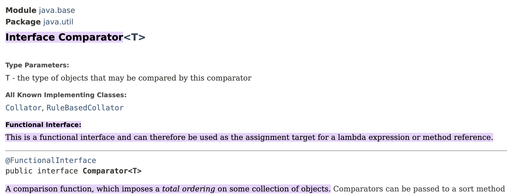
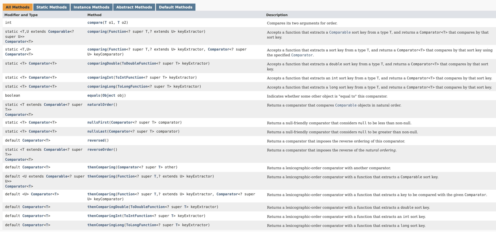

# Comparator Interface & Sorting

Using `Comparable` interface, we can sort objects based on the value of only one field. In case, you want to compare objects based on another field, you have to modify the implemetation of overidden`compareTo`() method.&#x20;

However with  `Comparator` interface, we can create multipbe comparators for different fields.

<figure><figcaption></figcaption></figure>

<figure><figcaption></figcaption></figure>

Here, all the methods have default implementation except the `compare()` method.

***


```java
public class Customer { 
    private String name;
    private String email;

    public Customer(String name, String email) {
        this.name = name;
        this.email = email;
    }

    @Override
    public String toString() {
        return "Customer [name=" + name + "]";
    }
    
    public String getName() {
        return name;
    }

    public String getEmail() {
        return email;
    }
}
```

Comparator for `name` field

```java
import java.util.Comparator;

public class NameComparator implements Comparator<Customer> {

    @Override
    public int compare(Customer o1, Customer o2) {
        return o1.getName().compareTo(o2.getName());
    }
}
```

Comparator for `email` field

```java
import java.util.Comparator;

public class EmailComparator implements Comparator<Customer> {

    @Override
    public int compare(Customer o1, Customer o2) {
        return o1.getEmail().compareTo(o2.getEmail());
    }
}
```

Demo

```java
import java.util.ArrayList;
import java.util.List;

public class SortingDemo {

    public static void show() {
        // Sorting with Comparator Interface
        List<Customer> customerList = new ArrayList<>();
        customerList.add(new Customer("Elizabeth", "b.elizabeth@gmail.com"));
        customerList.add(new Customer("John", "a.john@gmail.com"));
        customerList.add(new Customer("Charlie", "c.charlie@gmail.com"));
        
        System.out.println(customerList); // Output: [Customer [name=Elizabeth], Customer [name=John], Customer [name=Charlie]]
        
        // Sorting based on name
        Collections.sort(customerList, new NameComparator());
        System.out.println(customerList); // Output: [Customer [name=Charlie], Customer [name=Elizabeth], Customer [name=John]]
        
        // Sorting based on email
        Collections.sort(customerList, new EmailComparator());
        System.out.println(customerList); // Output: [Customer [name=John], Customer [name=Elizabeth], Customer [name=Charlie]]

    }
}
```

