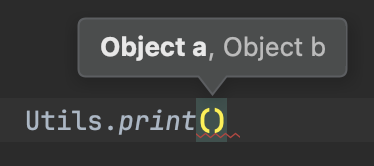
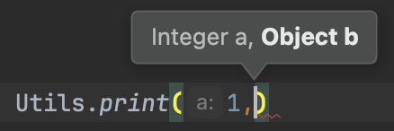

# Multiple Type Parameters

## Methods with multiple type parameters

```java
public class Utils {
    // Generic method with multiple type parameters
    public static <K, V> void print(K a, V b) {
        System.out.println(a + " = " + b);
    }
}

public class Main {
    public static void main(String[] args) {
        Utils.print(1, "hello");
    }
}
```

<div>

<figure><figcaption></figcaption></figure>

 

<figure><figcaption></figcaption></figure>

</div>

## Classes with multiple type parameters

```java
public class KeyValuePair<K,V> {

    private K key;
    private V value;

    public KeyValuePair(K key, V value) {
        this.key = key;
        this.value = value;
    }
}
```


