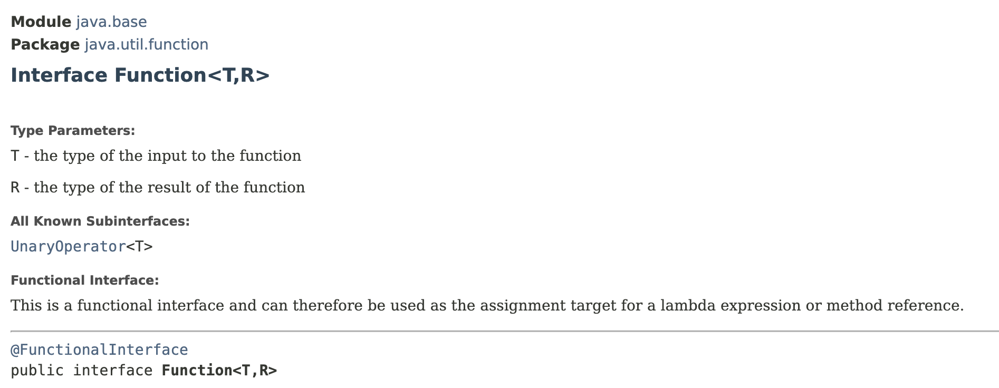
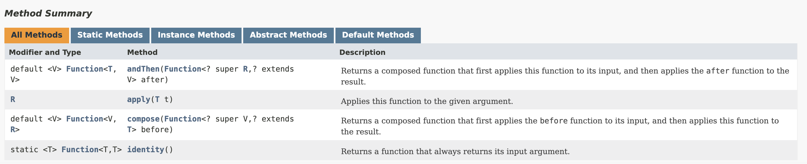

# Function Interface

> **Represents a function/operation that can map a value to a different value;**&#x20;
>
> operation/function that takes an argument and returns a value


`Function<T,R>` interface has 2 generic type parameters.

* `T` represents the type of the input to the function
* `R` represents the type of the result of the function

<figure><figcaption></figcaption></figure>

<figure><figcaption></figcaption></figure>



There are 4 methods in this interface and 3 of then have default implementation.&#x20;

The only **abstract method** is the `apply()` method that takes an argument of type `T` and returns a value of type `R`.

```java
import java.util.function.Function;

public class LambdasDemo {
    public static void main(String[] args) {
        // set function to a lambda expression that takes a string and return an integer
        Function<String, Integer> map = str -> str.length();

        System.out.println(map.apply("Sky")); // Output: 3
    }
}
```

## Variations of `Function<T,R>` Interface

We have few specialisations of `Function` interface.

* [BiFunction\<T,U,R>](https://docs.oracle.com/en/java/javase/12/docs/api/java.base/java/util/function/BiFunction.html)
  * takes 2 arguments and returns a result&#x20;

We also have **primitive specialisations** and these specialisations falls into 3 categories.

1. **Category 1**: Arguments have a specific type, but the return values parameterised.
   * [IntFunction\<R>](https://docs.oracle.com/en/java/javase/12/docs/api/java.base/java/util/function/IntFunction.html)
     * represents a function(i.e: `accept()` method) that takes a primitive integer and returns a value of type `R`
   * LongFunction\<R>
   * DoubleFunction\<R>
2. **Category 2**: The argument is parameterised.&#x20;
   * [ToIntFuntion\<T>](https://docs.oracle.com/en/java/javase/12/docs/api/java.base/java/util/function/ToIntFunction.html)
     * represents a function that returns a primitive integer&#x20;
     * argument is parameterised
     * return value is a primitive integer
   * ToLongFunction\<T>
   * ToDoubleFunction\<T>
3. **Category 3**: Both the argument and return type are specialised&#x20;
   * [IntToLongFunction](https://docs.oracle.com/en/java/javase/12/docs/api/java.base/java/util/function/IntToLongFunction.html)
     * represents a function that takes a primitive integer and returns a primitive long
   * IntToDoubleFunction


## Composing Functions


[composing-functions.md](composing-functions.md)


