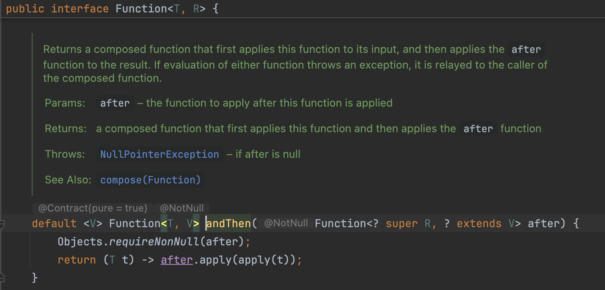
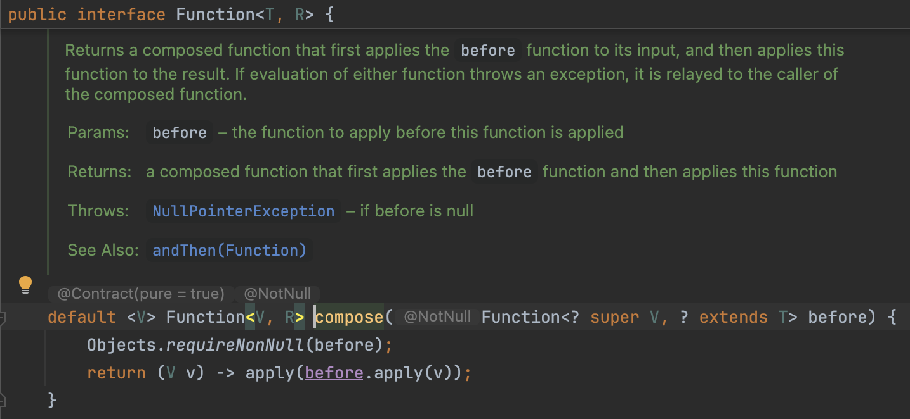

# Composing Functions

## Compose with `andThen()` method

<figure><figcaption></figcaption></figure>

* This method takes a `Function` and it returns another `Function`.
* In the body of this `Function`, first we make sure the argument is not null.
* Then return another function represented using a lambda expression.
  * So we have a parameter of type `T`.
  * First we call `apply()` method on this argument.&#x20;
  * We get the result and pass it to the `apply()` method of the second function.


```java
import java.util.function.Function;

public class LambdasDemo {
    public static void main(String[] args) {
        // 2 transformations
        /*
        input: string (e.g: "key:value")
        1st transformation: replace colon with equal sign (e.g: "key=value")
        2nd transformation: add braces around the string (e.g: "key=value")
         */
        Function<String, String> replaceColonWithEqual = str -> str.replace(":", "=");
        Function<String, String> surroundWithCurlyBraces = str -> "{" + str + "}";
        
        // Declarative Programing
        var value = replaceColonWithEqual
                      .andThen(surroundWithCurlyBraces)
                      .apply("key:value");
        System.out.println(value); // Output: {key=value}
        
    }
}
```

* Here, `replaceColonWithEqual.andThen(surroundWithCurlyBraces)` returns a **`Function,`** If needed we can store this **`Function`** in a variable and call `apply()` on it later.


## Compose with `compose()` method

`compose()` method is similar to `andThen()`, but it orders/composes these functions in the reverse order.

<figure><figcaption></figcaption></figure>

```java
import java.util.function.Function;

public class LambdasDemo {
    public static void main(String[] args) {
        // 2 transformations
        /*
        input: string (e.g: "key:value")
        1st transformation: replace colon with equal sign (e.g: "key=value")
        2nd transformation: add braces around the string (e.g: "key=value")
         */
        Function<String, String> replaceColonWithEqual = str -> str.replace(":", "=");
        Function<String, String> surroundWithCurlyBraces = str -> "{" + str + "}";
        
        // Declarative Programing
        var value2 = surroundWithCurlyBraces
                        .compose(replaceColonWithEqual)
                        .apply("key:value");
        System.out.println(value2); // Output: {key=value}
        
    }
}
```
