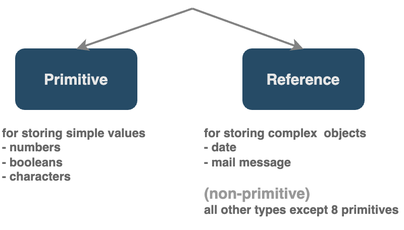

# Types

<figure><figcaption></figcaption></figure>


[primitive-types.md](primitive-types.md)



[reference-types.md](reference-types.md)



[memory-management-primitive-types-and-reference-types.md](memory-management-primitive-types-and-reference-types.md)



[primitive-types-vs-reference-types.md](primitive-types-vs-reference-types.md)



[strings-java.lang.string](strings-java.lang.string/)



[arrays.md](arrays.md)



[multi-dimensional-arrays.md](multi-dimensional-arrays.md)


