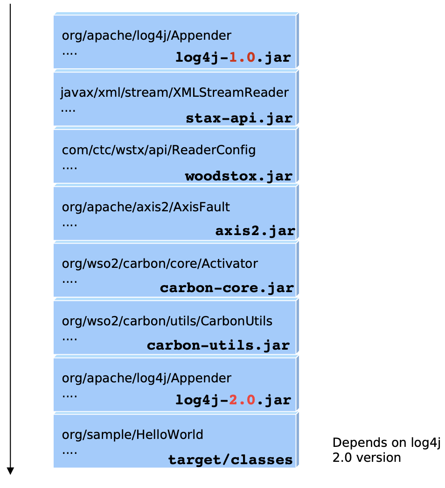

# Problem with JAR Files

## **JAR Files**

1. **Packaging**:
   * A JAR file is essentially a ZIP file with a `.jar` extension.
   * It includes compiled Java `.class` files, metadata, and resources.
2. **Manifest File**:
   * Contains metadata about the JAR file, such as the main class to run, version, and other properties.
   * Located at `META-INF/MANIFEST.MF`.
3. **Usage**:
   * Used to distribute Java applications and libraries.
   * Simplifies the deployment process by bundling all necessary files into one archive.


Typical **Java application** consists a **set of JAR files**.&#x20;


### Example Structure of JAR file

```
myapp.jar
├── META-INF/
│   └── MANIFEST.MF
├── com/
│   └── example/
│       └── MyApp.class
└── resources/
    └── config.properties
```

Example `MANIFEST.MF` File

```
Manifest-Version: 1.0
Created-By: 1.8.0_121 (Oracle Corporation)
Main-Class: com.example.MyMainClass
Class-Path: lib/library1.jar lib/library2.jar
```


## Problem with JAR Files


* **No runtime representation** for a JAR.&#x20;
*   At runtime contents of all JAR files are treated as a single, ordered and global list which is called the class path&#x20;

    ```
    java ­classpath log4j.jar:statx­api.jar:woodstox.jar:axis2.jar: carbon.jar:utils.jar:target/classes org.sample.HelloWorld
    ```

    * this launches a Java application with `log4j.jar` , `statx­api.jar`, `woodstox.jar`, `axis2.jar`,  `carbon.jar`, `utils.jar` and the `classes` directory on the classpath
    * The final parameter is the name of the **main** class to execute, which is compiled to the `org/sample/HelloWorld.class` in the `classes` directory per our assumption.


Java lacks dynamism.


* **Multiple versions** of JAR files **cannot be loaded simultaneously**&#x20;
* A JAR **cannot declare dependencies on other JARs**.&#x20;
* No mechanism for information hiding --> Hence, JARs cannot be considered as modules
* Can not update a part (can be a JAR file) of a running Java application
* **Can not add new functionality** to a new Java application at **runtime**
  * If you need to add new functionality or update existing functionality, **JVM needed to be restarted**.&#x20;


#### Example Problematic Scenario with JAR files

Here, HelloWorld class has a dependency on log4j version 2.0.&#x20;

But log4j version 1.0 is also available in the environemnt.

&#x20;What version of the Appender class is loaded?

<figure><figcaption></figcaption></figure>


