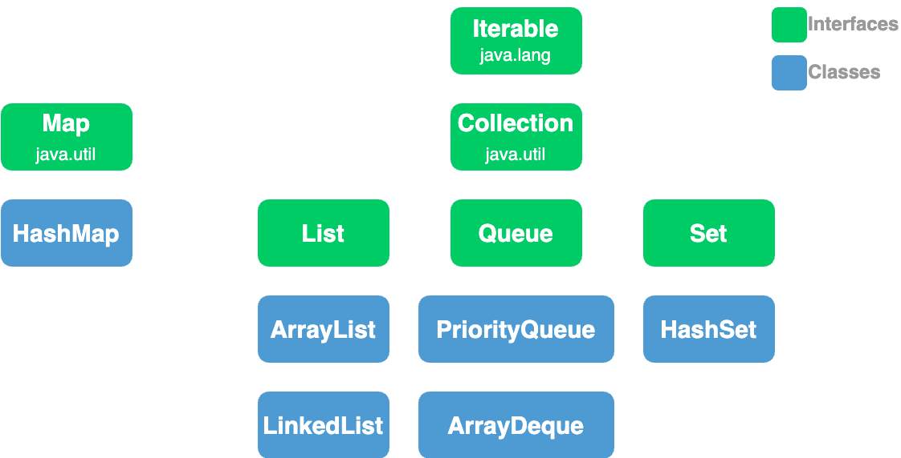
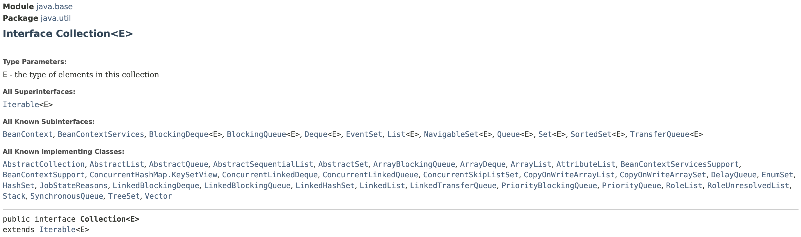
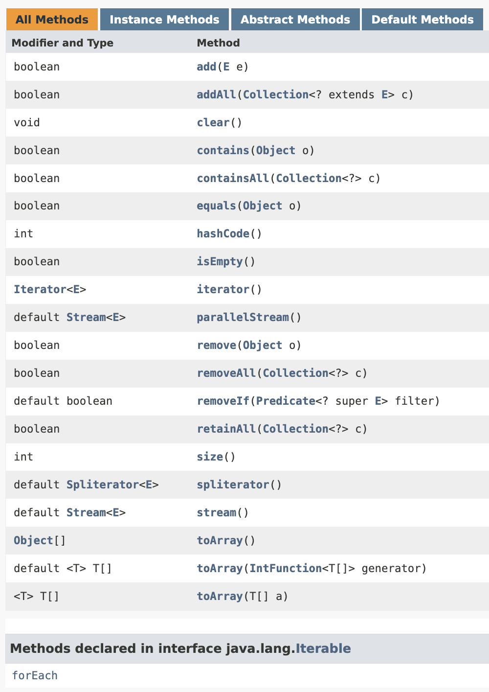

# Collections

**`Collections Framework`** comes with the **`standard Java Library`**. It is used when working with collection of objects (e.g. collection of users).

We have bunch of interfaces and general purpose implementations in Collections framework.

<figure><figcaption></figcaption></figure>

#### **`Iterable`** interface&#x20;

* represents an object that can be used in **`for each`** statement.
* If we implement this interface in our generic class, we will be able to use it in a **`for each`** loop.
* more accurately, not part of the collections framework&#x20;

#### **`Collection`** interface

* extends the `Iterable` interface and add additional functionality&#x20;
* represents an object that act like a **`container`** or a **`collection of objects`**.
* capabilities that we need in a collection
  * add object to collection
  * remove an object from collection
  * check for the existence of an object
  * ...

<figure><figcaption></figcaption></figure>

<figure><figcaption></figcaption></figure>

#### **`List`** interface

* extends `Collection` interface&#x20;
* allows us to work with an **`ordered collection`** and access objects in their index

#### **`ArrayList`** class

* implementation of the `List` interface
* implementation of a **`Dynamic Array`**
* internally it uses an array to store objects, if it gets full, it will automatically resize the array

#### **`LinkedList`** class

* another implementation of the `List` interface
* based on the linked **`list data`** structure

#### **`Queue`** interface

* extends the `Collection` interface
* provides additional operation for working with a **`queue of objects`**
* use queues in situations where we have a resource that can be shared amongst many consumers
  * e.g: printer at office
    * print cannot print all people's document at once simultaneously, but it can print one after another&#x20;
    * So each job should go in a queue.
    * The printer will then take these jobs one by one  and process them.

#### **`PriorityQueue`** class

* implements `Queue` interface

#### **`Set`** interface&#x20;

* extends `Collection` interface
* represents a **`collection without duplicates`**

#### **`HashSet`** class

* implements the `Set` interface


[iterable-interfacce.md](iterable-interfacce.md)



[collection-interface.md](collection-interface.md)



[list-interface.md](list-interface.md)



[comparable-interface-and-sorting.md](comparable-interface-and-sorting.md)



[comparator-interface-and-sorting.md](comparator-interface-and-sorting.md)



[queue-interface.md](queue-interface.md)



[set-interface.md](set-interface.md)



[hash-tables.md](hash-tables.md)



[map-interface.md](map-interface.md)


|  Interface |                       Implementation                      |
| :--------: | :-------------------------------------------------------: |
| Collection | ArrayList, LinkedList, ArrayDeque, PriorityQueue, HashSet |
|    List    |                   ArrayList, LinkedList                   |
|    Queue   |                 ArrayDeque, PriorityQueue                 |
|     Set    |                          HashSet                          |
|     Map    |                          HashMap                          |

