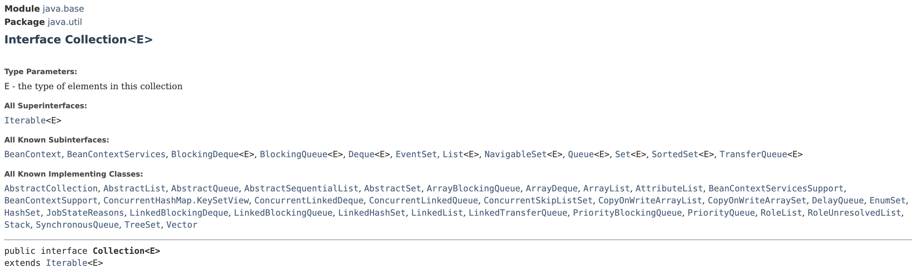

# Collection Interface

> **Represents an object that acts as a container for other objects**.
>
> * Don't care about the order or index. Thus, obects not accessible by index.

<figure><figcaption></figcaption></figure>

<figure><figcaption></figcaption></figure>


Every collection is iterable. i.e. we can use **for each** loop to iterate over a collection.

**`ArrayList`** implements `Collection` interface.


**`Collections`** class in `java.util` package is a utility class.

* This class consists exclusively of static methods (utility methods) that operate on or return collections.





❗ You cannot access an element by index directly from a **`Collection`** interface, as it doesn't provide methods for **indexed access**.&#x20;

&#x20;   ╰┈➤ However, you can access elements by **index** in classes that implement the **List** interface, such as **ArrayList**.

```java
ArrayList<String> list = new ArrayList<>();
list.add("Apple");
list.add("Banana");
list.add("Orange");

String element = list.get(1); // Access element by index
System.out.println(element);  // Output: Banana
```
