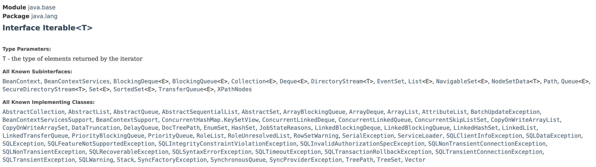
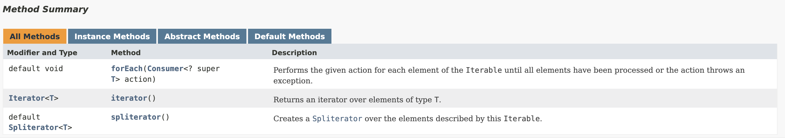

# Iterables

> **Represents an object that is iterable;** i.e we can iterate or loop over it.
>
> ╰┈➤ Allows us to iterate over an object without knowing anything about it's internal implementation details


`Iterable` interface is not part of the Collections framework.

* Instead part of the `java.lang` package. Thus one of the fundamental interfaces in Java.

## Need for Iterables

In the following implementation of `GenericList`, we cannot iterate over items in the list without making the items field public.&#x20;

```java
public class GenericList<T> {
    private T[] items =  (T[]) new Object[10];
    private int count;

    public void add(T item) {
        items[count++] = item;
    }

    public T get(int index) {
        return items[index];
    }

    @Override
    public Iterator<T> iterator() {
        return null;
    }
}

public class Main {
    public static void main(String[] args) {
        var list = new GenericList<String>();
        list.add("A");
        list.add("B");
    }
}
```

If we have to reveal details like fields to make iteration possible, it's a bad design. In OOP, we should expose an interface for others to use, so changes to internal implementation don’t affect other classes or interfaces.

## `Iterable` Interface

<figure><figcaption></figcaption></figure>

<figure><figcaption></figcaption></figure>

* First and last methods have default implementation, so we don't have to implement them.
* The only method we have to implement is the `iterator()` method.
  * it returns an `Iterator` object
    * Iterator is an object that we use to iterate over an iterable (like a list implementation that implements `Iterable` interface).

```java
public class GenericList<T> implements Iterable<T> {
    private T[] items =  (T[]) new Object[10];
    private int count;

    public void add(T item) {
        items[count++] = item;
    }

    public T get(int index) {
        return items[index];
    }

    @Override
    public Iterator<T> iterator() {
        // Implementation ...
        return null;
    }
}
```

### Iterating over list with expicit `Iterator` object

```java
public class Main {
    public static void main(String[] args) {
        var list = new GenericList<String>();
        list.add("A");
        list.add("B");

        // Iterate 
        var iterator = list.iterator();
        while (iterator.hasNext()) {
            var current = iterator.next();
            System.out.println(current);
        }
    }
}
```

<pre><code>... // Byte code of the Main class above

public class com/shadhini/java/tryouts/advanced/Main {
...

  // access flags 0x9
  public static main([Ljava/lang/String;)V
...
   L1
    LINENUMBER 84 L1
    ALOAD 1
    INVOKEVIRTUAL com/shadhini/java/tryouts/advanced/collections/GenericList.iterator ()Ljava/util/Iterator;
    ASTORE 2
    
...
   L4
    LINENUMBER 88 L4
   FRAME APPEND [com/shadhini/java/tryouts/advanced/collections/GenericList java/util/Iterator]
    ALOAD 2
    INVOKEINTERFACE <a data-footnote-ref href="#user-content-fn-1">java/util/Iterator.hasNext </a>()Z (itf)
    IFEQ L5
   L6
    LINENUMBER 89 L6
    ALOAD 2
    INVOKEINTERFACE j<a data-footnote-ref href="#user-content-fn-2">ava/util/Iterator.next</a> ()Ljava/lang/Object; (itf)
    CHECKCAST java/lang/String
    ASTORE 3
    
...
</code></pre>

### Iterating over list with  `for each` loop

```java
public class Main {
    public static void main(String[] args) {
        var list = new GenericList<String>();
        list.add("A");
        list.add("B");

        for (var item: list)
            System.out.println(item);
    }
}
```

<pre><code>... // Byte code of the Main class above

public class com/shadhini/java/tryouts/advanced/Main {
...

  // access flags 0x9
  public static main([Ljava/lang/String;)V
...

   L3
    LINENUMBER 96 L3
    ALOAD 1
    INVOKEVIRTUAL <a data-footnote-ref href="#user-content-fn-3">com/shadhini/java/tryouts/advanced/collections/GenericList.iterator</a> ()Ljava/util/Iterator;
    ASTORE 2
   L4
   FRAME APPEND [com/shadhini/java/tryouts/advanced/collections/GenericList java/util/Iterator]
    ALOAD 2
    INVOKEINTERFACE <a data-footnote-ref href="#user-content-fn-4">java/util/Iterator.hasNext ()</a>Z (itf)
    IFEQ L5
    ALOAD 2
    INVOKEINTERFACE java/util/Iterator.next ()Ljava/lang/Object; (itf)
    CHECKCAST java/lang/String
    ASTORE 3

...
</code></pre>

As you can see, when we use **`for each`** loop Java Compiler will convert our code to use an `Iterator` object. That's why we can iterate over this list, using a `for each` loop.

╰┈➤ **`For each`**` ``loop is syntactically sugar  over the`` `**`Iterator`**` ``object`.


## `Iterator` Interface

[^1]: Reference to Iterator.hasNext()

[^2]: Reference to Iterator.next()

[^3]: create Iterator

[^4]: Iterator hasNext() method call
