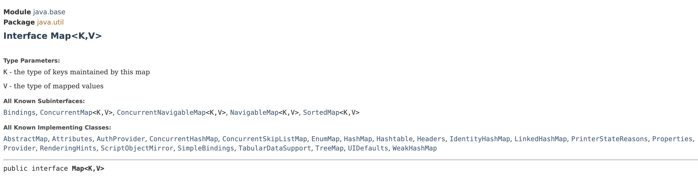

# Map Interface

## Map Interface

> **Maps a key to a value**
>
> \-- search -> O(1) time complexity
>
> \-- doesn't guarantee an order of objects

Part of the Collections framework, but not part of the `java.util.Collection` hierarchy.&#x20;

╰┈➤ So it's not a `Iterable` or `Collection`, it's something entirely different.


A generic interface with type parameters as key and value. Can be used to store **`key value pairs`**.

* Here every objet has 2 parts; key and value

<figure><figcaption></figcaption></figure>

`Map` Interface has many different implementations and most popular implementation is **`HashMap`**.

Rather than iterating over a loop to find a specific object, with `HashMap` we can retrieve an object by key with O(1) time complexity.

* This is extremely fast.
* And, it doesn't matter how many objects are stored in the map. The cost of finding an object is a constant.


Since `Map` interface is not an `Iterable`, you cannot use it in a **for each** loop; i.e. cannot iterate over Map object.

╰┈➤  However&#x20;

1. you can retrieve **`key set`** as an `Iterable` set and hence can go through the map by iterating over **`keys`** OR
2. you can retrieve **`entry set`** as an `Iterable` set and iterate over **`entries`**.
3. you can retrieve **`values`** as a **`Collection`** and iterate over the objects.

```java
// Iterate through objects of the Map 
// 1. Using Key Set
for (var key: map.keySet())
    System.out.println(map.get(key));// prints the objects
            
// 2. Using Entry Set
for (var entry: map.entrySet()) {
    System.out.println(entry); // prints entire entry; i.e. key-value pair
    System.out.println(entry.getKey()); // prints key
    System.out.println(entry.getValue()); // prints the object
}

// 3. Using values() and retireving vlaues as a Collection
for (var value: map.values())
    System.out.println(value); // this prints the objects 
```


