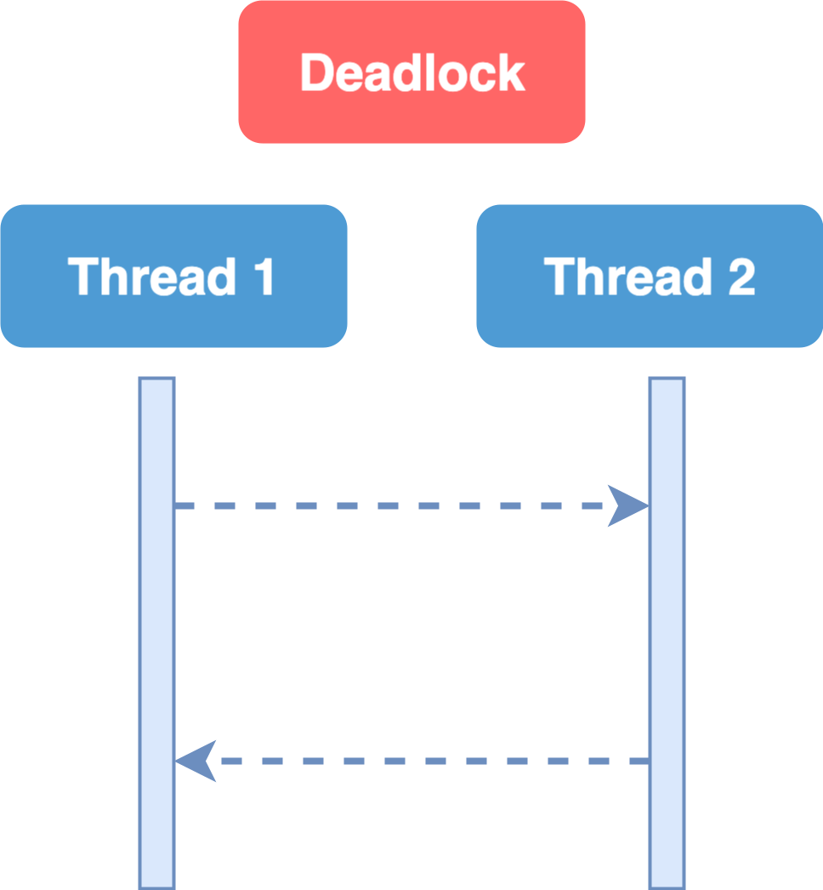

# Synchronization

## **Synchronization**

> **— prevent multiple threads from accessing the same object at the same time —**&#x20;
>
> Synchronization **forces the code to run sequentially**; which is against the idea of parallel execution.

* **`Synchronization`**: Synchronize or coordinate the access to an object across different threads.
* This is done using **`locks`**; when we put a lock on a certain part of our code, only one thread at a time can execute that part, other threads have to wait.

#### Synchronization is bad


Generally, **synchronization is bad**.

* You should avoid it as much as possible.


* Your code runs sequentially and you lose concurrency

## Problems with Synchronization

* Implementing synchronization is **challenging** and **error-prone**.
* You may cause deadlocks & bugs that are hard to reproduce and fix.

### Deadlocks

> **Deadlock**:
>
> **— happens when 2 threads wait for each other indefinitely —**&#x20;
>
> * can cause your application to crash

<figure><figcaption></figcaption></figure>

Here,

* Thread 1 waits for thread 2&#x20;
* And, at the same time, thread 2 waits for thread 1.

## Locks


[locks.md](locks.md)


## `synchronized` keyword, blocks & methods


[the-synchronized-keyword-blocks-and-methods.md](the-synchronized-keyword-blocks-and-methods.md)


