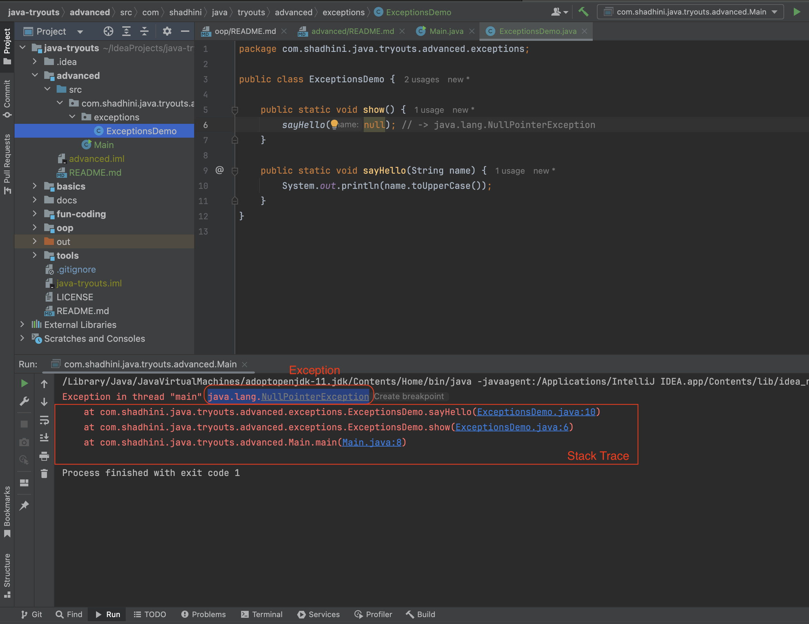

# Exceptions

## Exceptions

> **Exception is an object that contains information about an Error.**

When an exception occurs, an instance of the particular Exception class with details about the error is thrown.

<figure><figcaption></figcaption></figure>

## Stack Trace:&#x20;

> **sequence of method calls leading up to an exception**

* Shows the call hierarchy of methods at the point where the exception occurred, starting from the most recent method call and going back through the chain of method calls (the stack)
* This is very useful when troubleshooting problems; we can see exactly how we got to the offending code.

## How Java Runtime handles an Exception

When an exception occurs in a method, that method throws an exception.&#x20;

Java Runtime then looks for a block of code within that method to handle the exception -> the `Exception Handler.`

If no exception handler is found in the current method, Java Runtime moves to the previous method in the call stack and looks for exception handling there.&#x20;

If it's not available, it continues going back through the call stack, checking each method in reverse order of the calls.

If no exception handler is found throughout the entire stack, Java Runtime terminates the program and displays the exception.

## Best Practice&#x20;

✅ You should either prevent exceptions or should anticipate and handle exceptions.


[types-of-exceptions.md](types-of-exceptions.md)



[exceptions-hierarchy.md](exceptions-hierarchy.md)



[handle-exceptions.md](handle-exceptions.md)



[custom-exceptions.md](custom-exceptions.md)



[chaining-exceptions.md](chaining-exceptions.md)


