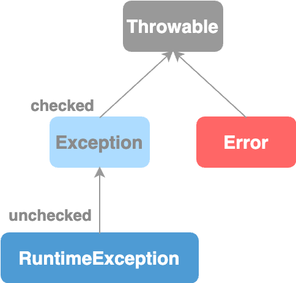
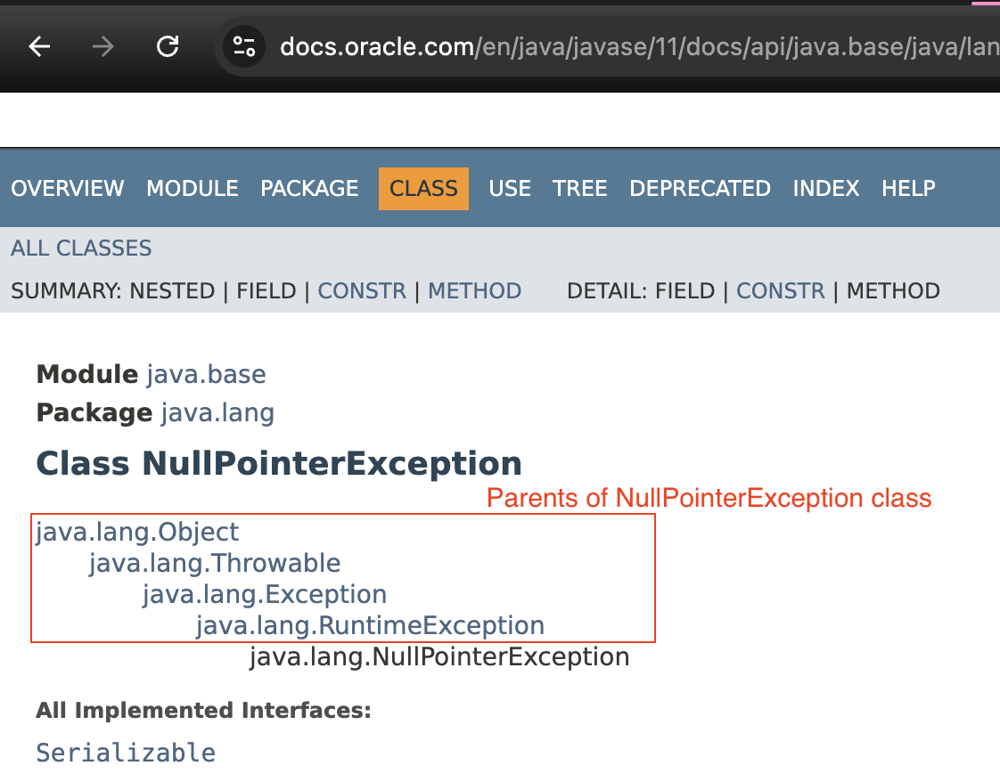
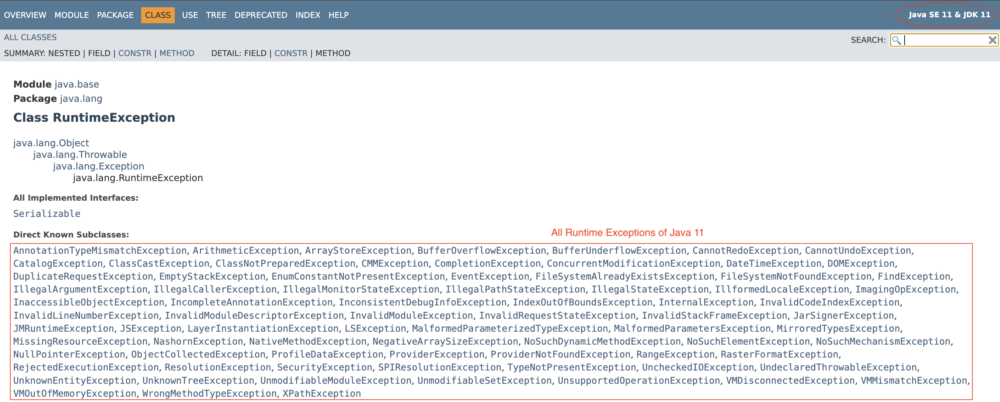

# Exceptions Hierarchy

<figure><figcaption></figcaption></figure>

### Throwable&#x20;

* Defines common characteristics for all exceptions and errors.
* e.g: error message, stack trace
  * every kind of exceptions and errors has a error message and stack trace.

### Error

* Error class and all it's sub types represent errors that are external to our application.

### Exception

* Parent class for all checked and unchecked exceptions.

### RuntimeException

* Represents all unchecked/ runtime exceptions.
* If an exception class is derived from `RuntimeException`, then it's considered an unchecked exception.
* Otherwise it's a checked exception.

<figure><figcaption></figcaption></figure>

<figure><figcaption></figcaption></figure>
