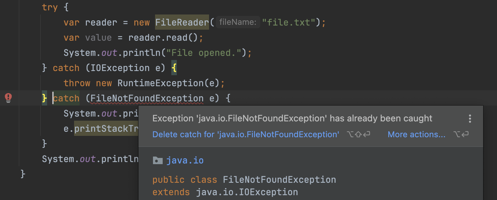
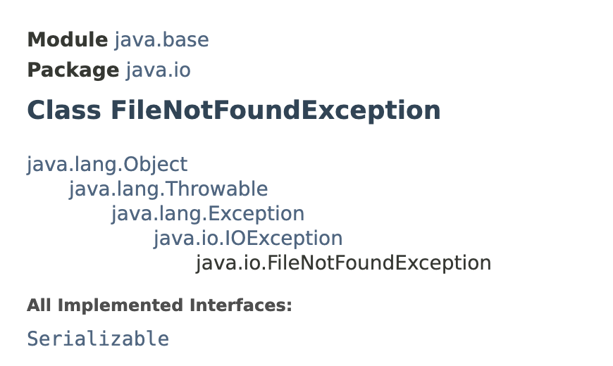
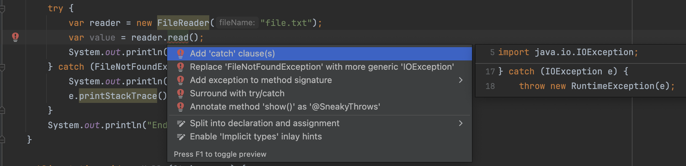
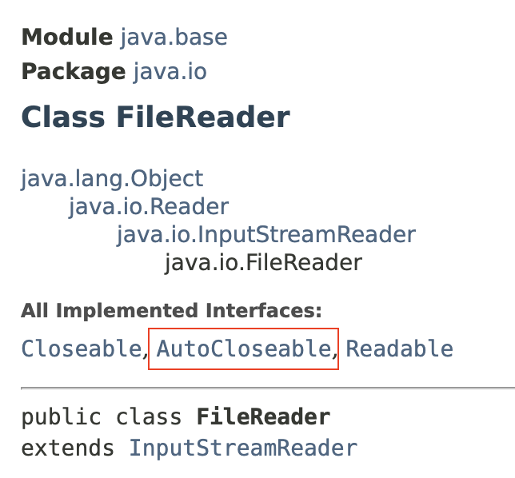
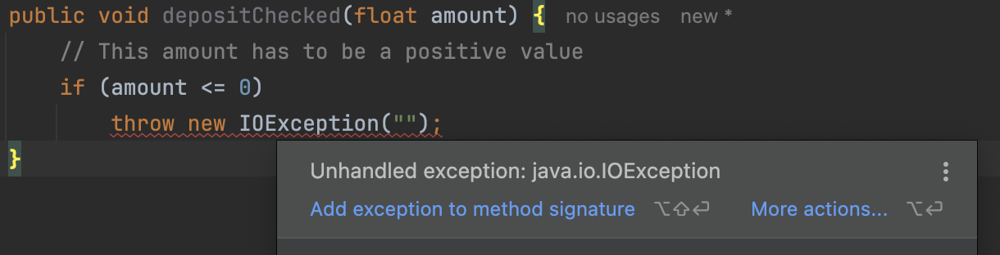

# Handle Exceptions

## Catching Exceptions

Proper Way to handle checked exceptions

<pre class="language-java"><code class="lang-java">try {
    // the code snippet that is likely to throw an excpetion
} catch (&#x3C;EXPCEPTION_CLASS> <a data-footnote-ref href="#user-content-fn-1">ex</a>) { // `ex` object is an instance of the &#x3C;EXCEPTION_CLASS>
    // what to do when exception is caught
    // can print a friendly message to the user
}
</code></pre>

* When a line of code throws an exceptions, then the control moves to the `catch block.`&#x20;
* So the code we have in the `try block` after the offending line will not be executed.&#x20;
* However, code after the `catch block` will be executed.

```java
public class ExceptionsDemo {

    public static void main(String[] args) {
        try {
            var reader = new FileReader("file.txt");
            System.out.println("File opened.");
        } catch (FileNotFoundException e) {
            System.out.println(e.getMessage());
            e.printStackTrace();
        }
        System.out.println("End of file reading.");
    }
}

/* Output:
file.txt (No such file or directory)
End of file reading.
java.io.FileNotFoundException: file.txt (No such file or directory)
	at java.base/java.io.FileInputStream.open0(Native Method)
	at java.base/java.io.FileInputStream.open(FileInputStream.java:219)
	at java.base/java.io.FileInputStream.<init>(FileInputStream.java:157)
	at java.base/java.io.FileInputStream.<init>(FileInputStream.java:112)
	at java.base/java.io.FileReader.<init>(FileReader.java:60)
	at com.shadhini.java.tryouts.advanced.exceptions.ExceptionsDemo.main(ExceptionsDemo.java:11)

Process finished with exit code 0
*/
```

## Catching Multiple Types of Exceptions

We can have multiple catch blocks where each catch block targets a specific type of exception.

```java
try {
    // the code snippet that is likely to throw excpetion/s
} catch (<EXPCEPTION_CLASS_1> ex) { 
    // what to do when exception of type EXPCEPTION_CLASS_1 is caught
} catch (<EXPCEPTION_CLASS_2> ex) { 
    // what to do when exception of type EXPCEPTION_CLASS_2 is caught
}
```

Here,

* only one of the catch blocks will be executed.

```java
public class ExceptionsDemo {

    public static void main(String[] args) {
        try {
            var reader = new FileReader("file.txt"); // --A
            var value = reader.read(); // --B
            System.out.println("File opened.");
        } catch (FileNotFoundException e) {
            // Gets executed if FileNotFoundException is thrown at line A
            System.out.println(e.getMessage());
            e.printStackTrace();
        } catch (IOException e) {
            // Gets executed if IOException is thrown at line B
            throw new RuntimeException(e);
        }
        System.out.println("End of file reading.");
    }
}
```

## Order of Catch Blocks

> **most specific catch blocks first and most generic catch blocks later**

<figure><figcaption></figcaption></figure>

<div align="left"><figure><figcaption></figcaption></figure></div>

Here

* `FileNotFoundException` is a sub type of `IOException`.&#x20;
* So if we has a catch block of `IOException`, it will catch `IOException` and all it's derivatives; the classes that extend `IOException` class.  -- **`Polymorphism`**
* Therefore, we don't need a catch block for `FileNotFoundException` after `IOException` catch block as `FileNotFoundException` is a `IOException` and it will be caught in `IOException` catch block.


Sometimes we want to handle all these exceptions in same way.&#x20;

╰┈➤ In that case, we can use one catch block with more generic exception types.

<pre class="language-java"><code class="lang-java"><strong>public class ExceptionsDemo {
</strong>
    public static void main(String[] args) {
        try {
            var reader = new FileReader("file.txt");
            var value = reader.read();
            new SimpleDateFormat().parse("");
        } catch (IOException | ParseException  e) {
            System.out.println(e.getMessage());
        } 
 
    }
}
</code></pre>

But sometimes, we want to handle different exceptions differently.

╰┈➤ In that case, we should add most specific catch blocks first and most generic catch blocks later.

```java
public class ExceptionsDemo {

    public static void main(String[] args) {
        try {
            var reader = new FileReader("file.txt");
            var value = reader.read();
            new SimpleDateFormat().parse("");
        } catch (FileNotFoundException e) {
            System.out.println(e.getMessage());
            e.printStackTrace();
        } catch (IOException e) {
            throw new RuntimeException(e);
        } catch (ParseException e) {
            System.out.println(e.getMessage());
        }
 
    }
}
```


## IntelliJIDEA support to add try catch blocks

<figure><figcaption></figcaption></figure>

## The `finally` block

> **`Used to release external resources`** like, file handles, database connections, network connections and so on occupied inside a try catch block.
>
> **`` `finally` block will always gets executed ``** whether we have an exception or not.

Say we are opening a file that exists for reading. But while reading data from the file something goes wrong and program terminates with an error message.&#x20;

<pre class="language-java"><code class="lang-java"><strong>// Problematic implementation
</strong><strong>public class ExceptionsDemo {
</strong>
    public static void main(String[] args) {
        try {
            var reader = new FileReader("file.txt");
            var value = reader.read(); // -- line C
            // reader.close() --> wrong
        } catch (IOException  e) {
            System.out.println("Could not read data.");
            // reader.close() --> wrong
        } 
         // ...
         // reader.close() --> wrong
    }
}
</code></pre>

Here, we have a problem.&#x20;

* File handlers are operating system resources. So, whenever we acquire them we should always release them. Otherwise other processes may not be able to access these resources.&#x20;

So somewhere in this code we should have `reader.close()`.

* But it shouldn't be inside the try block, as if an exception is thrown at the line C, then it well move the control to catch block. So if the `reader.close()` is added to the end of try block, it will never get executed in case an Exception occurs.
* We can't put it after the try catch blocks, because in case some code is added in between the try catch block and the `reader.close()` statement in the future, and in  case that code throws an exception, then again  `reader.close()` statement will not be executed.
  * Also, the `reader` variable will not be recognised as it has been created inside the try block.
* The right way to handle this kind of scenario is to use **`finally`** block.

```java
// sample implementation of try catch block with finally block
public class ExceptionsDemo {

    public static void main(String[] args) {
        FileReader reader = null;
        try {
            reader = new FileReader("file.txt");
            var value = reader.read(); // -- line C
        } catch (IOException e) {
            System.out.println("Could not read data.");
        } finally {
            if (reader != null) {
                try {
                    reader.close();
                } catch (IOException e) {
                    System.out.println(e.getMessage());
                }
            }
        }
    }
}
```


**`` `finally` block will always gets executed ``** irrespective of whether we have an exception or not.

* If our try block gets executed without exceptions, then after the try block, control will go to finally block.
* If our try block throws an exception, then the control will go to catch block and after executing catch block, the control will go to finally block.

## Try with resources Statement

> **Better way to release external resources, if the class implements** [**`AutoCloseable`**](https://docs.oracle.com/en/java/javase/11/docs/api/java.base/java/lang/AutoCloseable.html) interface.
>
> ╰┈➤ declare and initialise external resources as part of the try statement

In Java, we can declare and initialise our external resources as part of the try statement.

Try statement can have 1 or more resources.

```java
// Recommended implementation for releaseing external resources
public class ExceptionsDemo {

    public static void main(String[] args) {
        try (
                var reader = new FileReader("file.txt");
                var writer = new FileWriter("...");
        ) {
            var value = reader.read();
        } catch (IOException e) {
            System.out.println("Could not read data.");
        }
    }
}
```

With this structure, we don't have to close external resources explicitly inside the finally block. Java compiler will do that for us.

* So, when we compile this code, Java compiler will translate this code to what we had with the finally block.&#x20;
  * i.e. it will add a finally block to explicitly close the external resources initialised in the try statement.
* However, for this to work the class/es that we initialise in the try statement should implement the [**`AutoCloseable`**](https://docs.oracle.com/en/java/javase/11/docs/api/java.base/java/lang/AutoCloseable.html) interface.
  * The `close()` method is declared in this interface.

<div align="left"><figure><figcaption></figcaption></figure></div>


## Throwing Exceptions

### Throwing Runtime Exceptions

```java
// Example of Throwing a Runtime Exception
public class Account {

    public void deposit(double amount) {
        // This amount has to be a positive value
        if (amount <= 0)
            throw new IllegalArgumentException(); // Throwing a Runtime Exception
    }
}
```

### Throwing checked Exceptions

When we throw a checked exception from a method, caller of the method should handle it.

e.g: Like how we use FileReader class; FileReader class throws an exception that we have to explicitly handle.&#x20;

<figure><figcaption></figcaption></figure>

```java
// Example of Throwing a Checked Exception
public class Account {

    public void deposit(float amount) throws IOException {
        // This amount has to be a positive value
        if (amount <= 0)
            throw new IOException();
    }
}
```

Now here,

* API(Application Programming Interface) of this method: Anyone using the `deposit` method of `Account` class should know that this method is taking a `float` and throwing an `IOException`.

## Defensive Programming

Technique of validating argument and throwing an exception -> **`Defensive Programming`**

* If an invalid value of an argument can cause serious problems later in the code, we throw an exception and prevent the rest of our code from getting executed.&#x20;
* Here we are coding in a defensive manner.
* Better approach to avoid running into serious issues later.

But, this adds bit of noise to our code.

* it makes the code bit longer.

### When to use Defensive Programming

* If you are developing a framework for others to use.
* When you receive input from the user or external systems. That is at the boundary of your application.

❗If you are developing an application, you should have level of trust in your code. Your methods should trust each other. Don't pollute every method with data validation logic. Perform this kind of data validation only when you receive input from the user or external systems. That is at the boundary of your application. Not within the application itself.


## Re-throwing Exceptions

In real applications, when we catch these exceptions quite often we are going to log them somewhere. We are gonna store them in a file or in a database. So sometime in the future we can come back and see what errors we have in our applications.

In situation where we don't print an error message but just catch the exception and do something else, we should re throw it since then, somewhere else in the application we can get it and display it as a generic error message.

Desktop or mobile applications have a handler that catches all kinds of exceptions and displays a generic error message.

```java
public class Account {

    public void deposit(float amount) throws IOException {
        if (amount <= 0)
            throw new IOException();
    }
}

public class ExceptionsDemo {

    public static void show() throws IOException { 
        var account = new Account();
        try {
            account.depositChecked(1);
        } catch (IOException e) {
            System.out.println("Logging");
            throw e; // Re-throwing the Exception
        }
    }
}
public class Main {

    public static void main(String[] args) {
        try {
            ExceptionsDemo.show();
        } catch (Throwable e) { // Generic catch block to catch all kinds of exceptions
            System.out.println("An unexpected error occurred.");;
        }
    }
}
```

Above implementation make sure that no matter what kind of error is thrown our application shows a generic friendly message to the user.


[^1]: variable to hold the Exception object with information about the Exception occurred.
