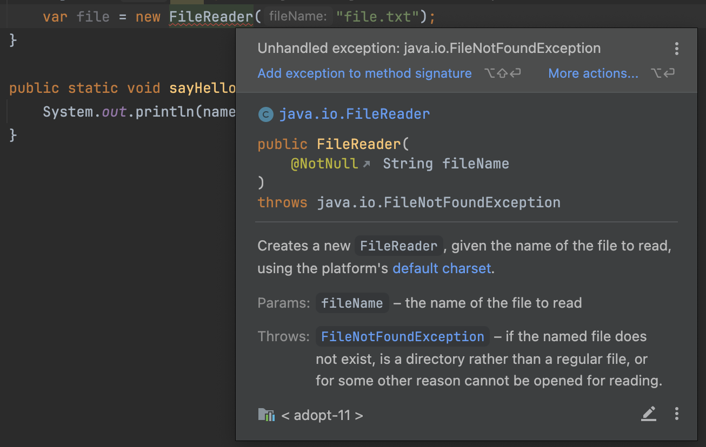

# Types of Exceptions

> 1. **`Checked Exceptions`**: checked by the Java compiler @ compile time, developer should anticipate and handle explicitly&#x20;
> 2. **`Unchecked / Runtime Exceptions`**: occurs due to programming errors, not detected by Java Compiler at compile time, developer should prevent these by testing and following best practices
> 3. **`Errors`**: error external to the application (StackOverflow, OutOfMemory), developer should identify the source of the error

## Checked Exceptions&#x20;

> **Exceptions that gets checked @ compile time by Java Compiler.**

✅️ Exceptions/edge cases that each developer should anticipate and handle explicitly.

* E.g: Try to read data from a file and file doesn't exist

Instead of letting the Java Runtime terminate our program, it's better to display a friendly message to the user saying that file doesn't exist.

`Java compiler` **`enforces`** us to handle these errors.

╰┈➤ That's why they are called **`Checked`** Exceptions. Because they get checked at compile time.

<figure><figcaption></figcaption></figure>

## Unchecked / Runtime Exceptions

> **Runtime exceptions that occurs due to programming errors and not detected by Java Compiler at compile time.**

* These exceptions are not checked by the Java Compiler at compile time.
* They occur because of programming errors.
* Unlike checked exceptions, we don't wanna recover these exceptions by displaying a friendly message.
* Instead we should prevent these exceptions from happening in the first place.
  * How to prevent them -> `Good coding practices` and `Testing` (preferably automated testing)

e.g: java.lang.NullPointerException

<pre class="language-java"><code class="lang-java">public class ExceptionsDemo {

    public static void show() {
        sayHello(null); // -> java.lang.NullPointerException
    }

    public static void sayHello(String name) {
        System.out.println(<a data-footnote-ref href="#user-content-fn-1">name.toUpperCase()</a>);
    }
}
</code></pre>

### Examples of Runtime Exceptions

**NullPointerException**

**ArithmeticException**&#x20;

* this gets thrown if you try to divide integer by zero

**IllegalArgumentException**

* indicates that the argument we passed to the method is not acceptable

**IndexOutOfBoundsException**

* occurs if we try to access an element on array or String or list using an invalid index&#x20;
* e.g: we have 5 elements in an array, but we try to access the 10th element

**IllegalStateException**

* gets thrown if we try to call a method but the underlying object is not in the right state

## Errors

> **Indicates an error external to the application.**

We can't display a friendly message to the user when these occurs.

We should try to identify the source of these errors.

These errors can happen because of programming errors like an infinite recursions, or for reasons outside of our application like a problem of Java Virtual Machine itself

### Examples

StackOverflow Error

OutOfMemory Error

* If the Java Virtual Machine (JVM) runs out of memory, there's nothing we can do about it&#x20;


[exceptions-glossary.md](exceptions-glossary.md)


[^1]: calling a method on a null objects leads to NullPointerException
