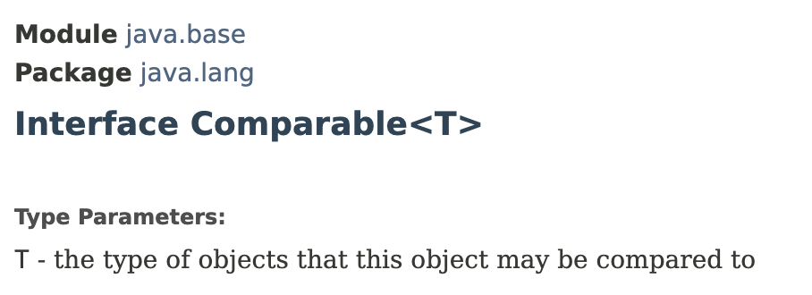
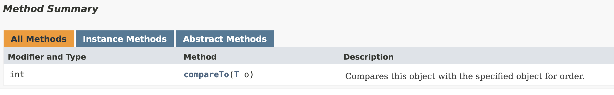

# Comparable Interface

A generic interface used to compare 2 objects.

<div align="left">

<figure><figcaption></figcaption></figure>

</div>

<figure><figcaption></figcaption></figure>

## Benefit

Lot of sorting algorithms are based on comparing objects. With these comparisons we can determine which object should come first.


## Usage Example

To be able to compare 2 `User` objects, we should implement this method in our User class.

***

If we don't provide a generic type argument to the `Comparable` interface, the `compareTo()` method to be implemented will accept an `Object` type as its parameter.

```java
public class User implements Comparable {

    @Override
    public int compareTo(Object o) { 
        return 0;
    }
}
```


**Cons:**

* Here, we are comparing a `User` object with an instance of the `Object` class. Since we need to explicitly cast the instance of `Object` class to a `User` type, we might end up with getting `ClassCastExceptions` at runtime.


***

If we provide `User` class as the generic type argument to the `Comparable` interface, the `compareTo()` method to be implemented will accept a `User` object.

```java
public class User implements Comparable<User> {

    @Override
    public int compareTo(User o) {
        return 0;
    }
}
```

╰┈➤ `We should always specify generic type argument when implementing`` `**`Comparable`**` ``interface`.

***

ℹ️ `<` is used only to compare numbers and characters.

```java
public class User implements Comparable<User> {

    private int points;

    public User(int points) {
        this.points = points;
    }

    @Override
    public int compareTo(User other) {
        // this < other     -> -1
        // this == other    -> 0
        // this > other     -> 1
        return points - other.points;
    }
}

public class Main {

    public static void main(String[] args) {
        var user1 = new User(10);
        var user2 = new User(20);
        
        if ((user1.compareTo(user2)) < 0) {
            System.out.println("User1 < User2");
        } else if ((user1.compareTo(user2)) == 0) {
            System.out.println("User1 == User2");
        } else {
            System.out.println("User1 > User2");
        }

    }
}
```


