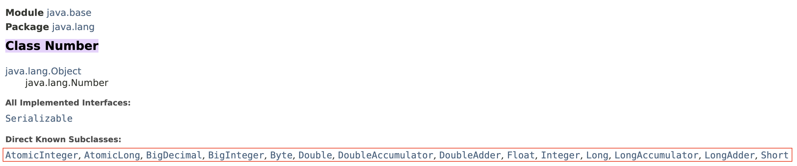
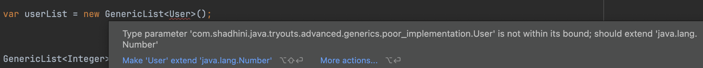

# Constraints

## Constraints on Type Parameter

> we can add **`constraints/restrictions`** to type parameter by&#x20;
>
> ╰┈➤ **`extending it by a class or interface or multiple interfaces.`**
>
> ╰┈➤ with these constraints we have **`Bounded type parameters`**.

There are times we want to put **constraints or restrictions on the type parameter.**

***

## Extend by a class

e.g: We want to store only numbers in a generic list. Say this list is gonna have some operations that makes sense for only numbers. We can do that by extending the type parameter from a super class/interface from which all our interested types are derived from.

<pre class="language-java"><code class="lang-java">public class GenericList&#x3C;T extends <a data-footnote-ref href="#user-content-fn-1">Number</a>> {
    private T[] items =  (T[]) new Object[10];
    private int count;

    public void add(T item) {
        items[count++] = item;
    }

    public T get(int index) {
        return items[index];
    }
}
</code></pre>

<figure><figcaption></figcaption></figure>

Now, when instantiating this `GenericList,` we can pass only Number type or any class that has been derived from the Number class as the type parameter.

<figure><figcaption></figcaption></figure>

***

## Extend by multiple interfaces

```java
public class GenericList<T extends Comparable & Cloneable> {
    private T[] items =  (T[]) new Object[10];
    private int count;

    public void add(T item) {
        items[count++] = item;
    }

    public T get(int index) {
        return items[index];
    }
}
```

Now, we are saying that we can send only the classes that implement both `Comparable` & `Cloneable`  as the type parameter to `GenericList` class.&#x20;

i.e This `GenericList` can store objects that are only comparable and cloneable.


[^1]: constraint
