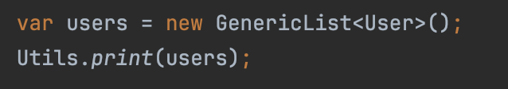
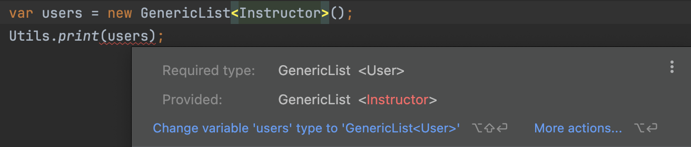

# Generic classes & Inheritance

```java
public class GenericList<T extends Comparable & Cloneable> {
    private T[] items =  (T[]) new Object[10];
    private int count;

    public void add(T item) {
        items[count++] = item;
    }

    public T get(int index) {
        return items[index];
    }
}

public class Instructor extends User {
    public Instructor(int points) {
        super(points);
    }
}

public class Utils {
    public static void print(GenericList<User> users) {
        // Implementation ...
    }
}
```

<div align="left"><figure><figcaption></figcaption></figure></div>

<figure><figcaption></figcaption></figure>

Here, we get this compile error because `GenericList` of users is not a subtype of generic list of instructors.

`This GenericList internally stores a list of`` `**`objects`**` ``no matter what we pass here as the type parameter`. So we have a single generic list of objects. And this class (i.e. `Object` class) is not a subtype of itself.

╰┈➤ That is why `GenericList` of instructors is not a subtype of `GenericList` of users.&#x20;

╰┈➤ Because we are dealing with a single class.

This issue can be solved with **`wildcards`**.



[wildcards.md](wildcards.md)



