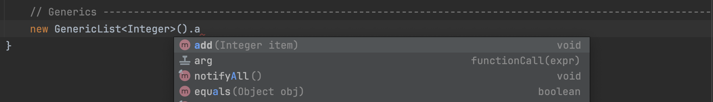
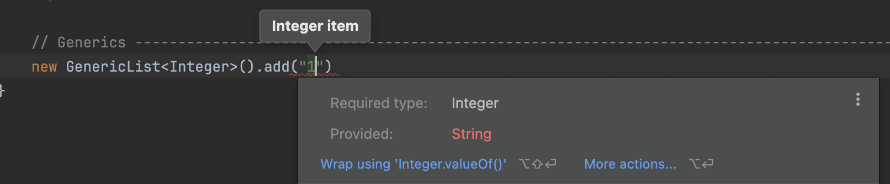
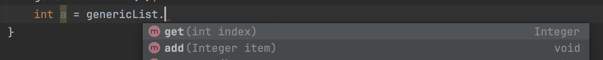

# Generic Classes

## Generic Class Declaration

<pre class="language-java"><code class="lang-java">public class <a data-footnote-ref href="#user-content-fn-1">GenericList</a>&#x3C;<a data-footnote-ref href="#user-content-fn-2">T</a>> {
}
</code></pre>

Here the letter inside the angle brackets `<>` can be any letter. By convention we use `T` or `E`.

* `T` short for Type/Template&#x20;
* `E` for element -> used when we want to implement a class that acts as collection; so we can store many elements

Letter between angle brackets `<>` is the `Type parameter` for the class.

* Just like our methods can have parameters, our classes can have parameters as well. The `T` here, represents the `type of objects we want to store in this list`.

```java
public class GenericList<T> {
}
```

When we create an instance of this class, we have to specify an argument or value for this parameter.

```java
new GenericList<String>();
new GenericList<User>();
new GenericList<Integer>();
```

***

```java
// To store different types of objects
public class GenericList<T> {
    private T[] items =  (T[]) new Object[10];
    private int count;

    public void add(T item) {
        items[count++] = item;
    }

    public T get(int index) {
        return items[index];
    }
}
```

* The array cannot be instantiated at the field declaration since, at that stage the Java Compiler doesn't know what's `T` going to be; what's the type of `T`. That's why `Object` array is created and then it's casted to array of `T` type.


## Benefit of Generics

#### Compile Time Type Safety

<figure><figcaption></figcaption></figure>

<figure><figcaption></figcaption></figure>

Say,  you have created a GenericList of Integers. If you try to add a string to that list, then it gives a `compile time error` as above.&#x20;

Here, generic class for list ensures that every element you add to the integer list is an integer.


#### Cleaner Code

<figure><figcaption></figcaption></figure>

Also when retrieving objects from the generic list, you `don't have to cast the items explicitly.` As a generic list of integers make sure that every object returned with `get()` method is an integer.


[^1]: Class Name

[^2]: We can use any letter here.\
    Type parameter for this class.
