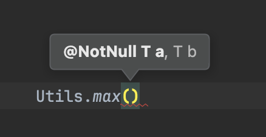
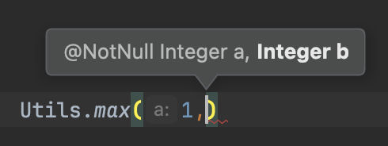
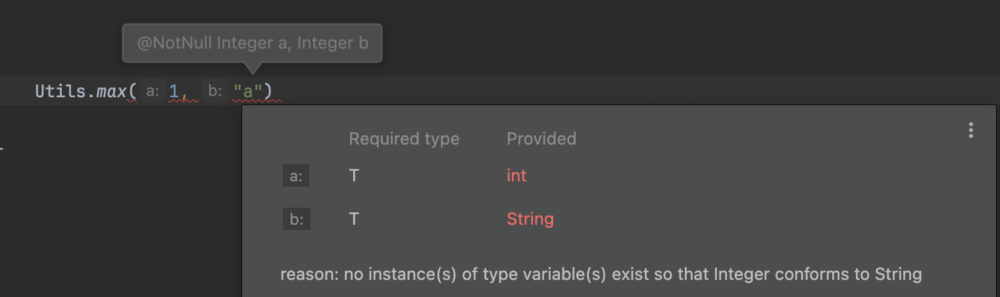

# Generic Methods

> Generic methods can be declared in both generic and non-generic classes

## Generic methods in generic class

```java
public class GenericList<T extends Comparable & Cloneable> { // Generic Class
    private T[] items =  (T[]) new Object[10];
    private int count;

    public void add(T item) { // Generic Method
        items[count++] = item;
    }

    public T get(int index) { // Generic Method
        return items[index];
    }
}
```

## Generic methods in non-generic class

<pre class="language-java"><code class="lang-java">// example structure of a generic method in non-generic class
public static <a data-footnote-ref href="#user-content-fn-1">&#x3C;T extends Comparable&#x3C;T>></a> <a data-footnote-ref href="#user-content-fn-2">T</a> max(<a data-footnote-ref href="#user-content-fn-3">T</a> a, <a data-footnote-ref href="#user-content-fn-3">T</a> b) {
    return a.compareTo(b) > 0 ? a : b;
}
</code></pre>

```java
public class User implements Comparable<User> {

    private int points;

    public User(int points) {
        this.points = points;
    }

    @Override
    public int compareTo(User other) {
        return points - other.points;
    }
    
    @Override
    public String toString() {
        return "Points = " + points;
    }
}

public class Utils {

    // Generic method
    public static <T extends Comparable<T>> T max(T a, T b) {
        return a.compareTo(b) > 0 ? a : b;
    }
}

public class Main {

    public static void main(String[] args) {
        System.out.println(Utils.max(1, 2)); // Output: 2
        System.out.println(Utils.max(new User(20), new User(10))); // Output: Points = 20
    }
}
```

## Benefit of Generic Methods

> **compile time type safety**&#x20;

<div><figure><figcaption></figcaption></figure> <figure><figcaption></figcaption></figure></div>

<figure><figcaption></figcaption></figure>


[^1]: indication that this is a generic method outside generic class and constraints on the generic type parameter

[^2]: Return type

[^3]: parameter type
