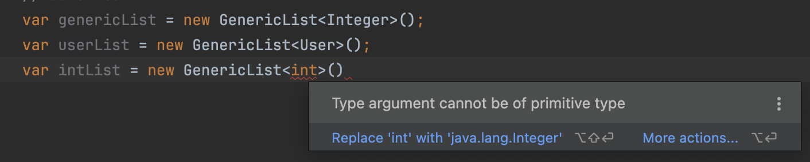

# Generics and Primitive Types

## Generics and Primitive Types

> **When creating an instance of a generic type, we can only pass a reference type as generic type argument**.

<figure><figcaption></figcaption></figure>

## Boxing

If you want to create a generic list of a primitive type, then you have to use the wrapper class of that primitive type. Every primitive type in Java has a wrapper class.

```java
// int      -> Integer
// boolean  -> Boolean
// float    -> Float 
// ...
var genericIntList = new GenericList<Integer>();
GenericList<Integer> numbers = new GenericList<>();
numbers.add(1); // -- A: BOXING
int value = numbers.get(0); // -- B: Unboxing
```

Here, @ A what happens is, even if we  pass a primitive to the `add()` method, Java compiler will automatically wrap this value inside an instance of the Integer class.&#x20;

So here Java Compiler is creating an instance of Integer class to wrap this primitive value. i.e. Java compiler puts this primitive value inside a Box.

╰┈➤ This process is called **`Boxing`**

╰┈➤ <kbd>Automatically converting a primitive value to its wrapper object.</kbd>

Here, @ B, Java compiler is gonna extract the value that is stored in that Integer object.

╰┈➤ This process is called **`Unboxing`**

╰┈➤ <kbd>Automatically converting a wrapper object back to its primitive value.</kbd>


