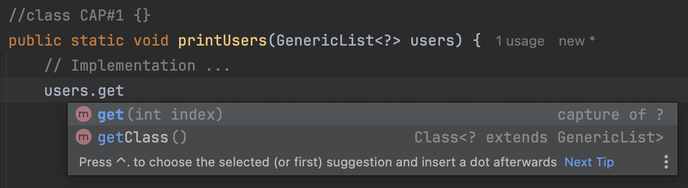
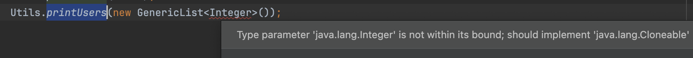
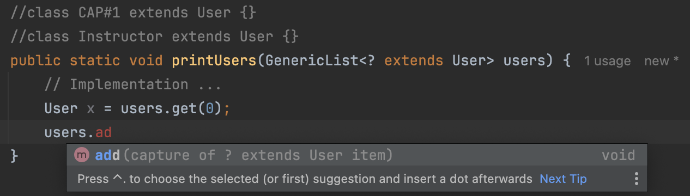
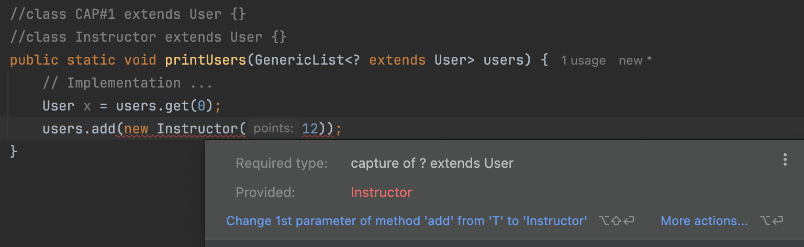

# Wildcards

```java
public class GenericList<T extends Comparable & Cloneable> {
    private T[] items =  (T[]) new Object[10];
    private int count;

    public void add(T item) {
        items[count++] = item;
    }

    public T get(int index) {
        return items[index];
    }
}

public class User implements Comparable<User>, Cloneable {
    // Implementation
}

public class Instructor extends User {
    public Instructor(int points) {
        super(points);
    }
}

public class Utils {

    public static void printUsers(GenericList<?> users) {
        // Implementation ...
    }
}

public class Main {

    public static void main(String[] args) {
        var users = new GenericList<Instructor>();
        Utils.printUsers(users); 
        // No compile time erros with the wildcard method declaration
        Utils.printUsers(new GenericList<Integer>()); 
        // However, here we can pass GenericList of anything.
    }
}
```

When a wildcard ? is set as the type parameter of the `GenericList` class in a method parameter declaration as below, we can pass `GenericList` of any type to that method as arguments. We can pass even a `GenericList` of integers.

```java
// class CAP#1 {}
public static void printUsers(GenericList<?> users) {
    // Implementation ...
}
```

***

When we use a **wildcard**, the `Java Compiler` is going to create an **`anonymous type`** under the hood. This is going to be a regular class in Java. We won't see it, but it's there.

Also, we can have multiple wildcards in the method parameter declaration.

<figure><figcaption></figcaption></figure>

So the `get` method here, returns an instance of this capture class. i.e. If we get an object here, we can store it only in a variable of type capture (say CAP#1) or it's base type. That is `Object` class.

```java
//class CAP#1 {}
public static void printUsers(GenericList<?> users) {
    Object x = users.get(0);
}
```


## Add constraints on Wildcards

### Constraint with `extend` to read elements from the GenericList of anonymous type

```java
public class Utils {
    //class CAP#1 extends User {}
    //class Instructor extends User {}
    public static void printUsers(GenericList<? extends User> users) {
        // Implementation ...
        User x = users.get(0);
    }
}

public class Main {
    public static void main(String[] args) {
        var instructors = new GenericList<Instructor>();
        var users = new GenericList<User>();
        Utils.printUsers(users);
        Utils.printUsers(instructors);
    
    }
}
```

When `Java Compiler` sees this implementation, it's going to have capture class (say CAP#1) extend the `User` class.

Now we cannot pass `GenericList` of integers when calling this method. It should be either `GenericList` of `Users` or one of it's subtypes.

<figure><figcaption></figcaption></figure>

Now we can retrieve an object from the `GenericList` and can assign it to a `User` variable since `User` class is the parent of this anonymous `CAP#1` type now.&#x20;

However we cannot assign the variable to a `Instructor` variable since `Instructor` and `CAP#1` are entirely 2 different classes like `Integer` and `String` classes. There's no connection between `Instructor` and `CAP#1` classes.

Also, with this implementation we cannot add `Instructor` objects to the `GenericList`.

<figure><figcaption></figcaption></figure>

<figure><figcaption></figcaption></figure>

### Constraint with `super` to add elements to the GenericList  of anonymous type&#x20;

If you want to add to a `GenericList`, you should use **`super`** keyword instead of **`extend`** keyword.

```java
public class Utils {
    //class User extends Object {}
    //class Instructor extends User {}
    public static void printUsers(GenericList<? super User> users) {
        // Implementation ...
        users.add(new User(1));
        users.add(new Instructor(12));
        Object x = users.get(0);
    }
}

public class Main {
    public static void main(String[] args) {
        var instructors = new GenericList<Instructor>();
        var users = new GenericList<User>();
        Utils.printUsers(users);
        // ?? cannot pass list of instructors to this method now
    }
}
```

When Java Compiler sees this expression (`? super User`), it's gonna treat this unknown type as the parent of the `User` class.

So, the `users` list parameter above will be treated as if it was created as  the `users` list below;

```java
GenericList<ParentOfUserClass> users = new GenericList<>();
// i.e.
GenericList<Object> users = new GenericList<>();
```

Now, to this you can add instance of the `Object` class or any of it's subtypes.

```java
users.add(new User(1));
users.add(new Instructor(12));
```

Here, both `User` and `Instructor` types are directly or indirectly derived from the  `Object` class.&#x20;

However, if you use `super` keyword we cannot read `User`s from this list. &#x20;

╰┈➤ If you retrieve an object you'd have to store it in a variable of type `Object`  or you'll have to downcast. Downcasting may lead to `ClassCastException`.

```java
Object x = users.get(0);
```

