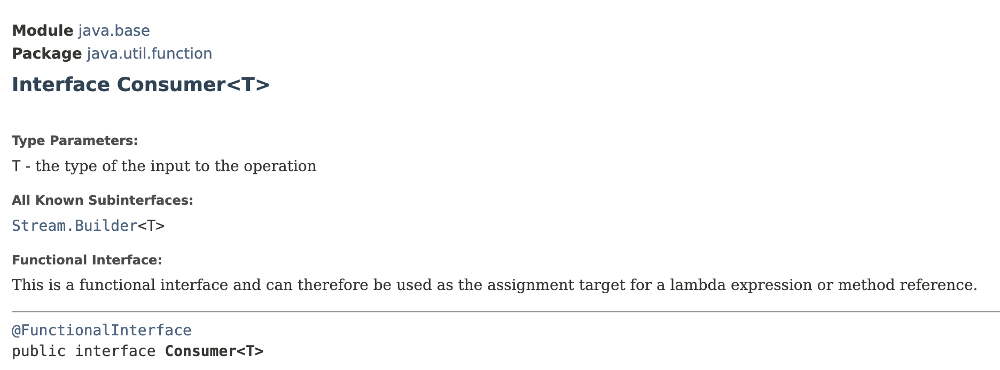
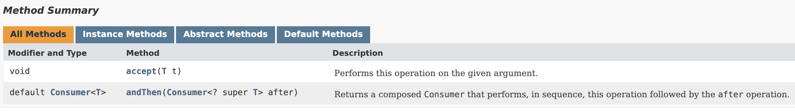
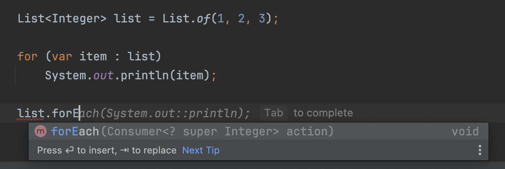

# Consumer Interface

## Consumer Interface

> **Represents an operation that takes a single argument and doesn't return a value**
>
> ╰┈➤ Consumes a value

e.g:

```java
public interface Printer {
    void print(String message);
    // This `print` method simply cosumes the `message`; 
    // takes a single argument and doesn't return a value
}
```

Lot of methods in Java expects an object that implements the `Consumer` interface.

***

`Consumer<T>` interface has one abstract method `accept`, and a default method.

<figure><figcaption></figcaption></figure>

<figure><figcaption></figcaption></figure>



## Variations of `Consumer<T>` Interface

There are few variations of `Consumer<T>` interface.

1. [BiConsumer\<T, U>](https://docs.oracle.com/en/java/javase/12/docs/api/java.base/java/util/function/BiConsumer.html)
   * The `accept` method takes 2 arguments.
2. [IntConsumer](https://docs.oracle.com/en/java/javase/12/docs/api/java.base/java/util/function/IntConsumer.html)
   * A primitive specialisations of `Consumer<T>` interface.
   * The `accept` method, takes a primitive integer.
   * ✅️  If you are dealing with lot of integers it is **more efficient** to use this interface as opposed to a regular `Consumer<T>` interface.&#x20;
     * Because with this interface, we **don't pay the cost of** **auto boxing**.
3. LongConsumer
4. DoubleConsumer

## Iterate over list with Consumer&#x20;

<div align="left"><figure><figcaption></figcaption></figure></div>

Here, the `forEach` method of the list object expects a `Consumer` object; in fact a `Consumer` of an `Integer`.

Consumer interface is a functional interface as it has a single abstract method. So we can represent it using a **lambda expression**.&#x20;

In this case, we want to pass a lambda expression that takes an `Integer` and doesn't return a value.

```java
List<Integer> list = List.of(1, 2, 3);

// Imperative Programming
for (var item : list)
    System.out.println(item);

// Declarative Programming with Lambda expression
list.forEach(item -> System.out.println(item));
list.forEach(System.out::println);
```


## Chaining Consumers


[chaining-consumer.md](chaining-consumer.md)


