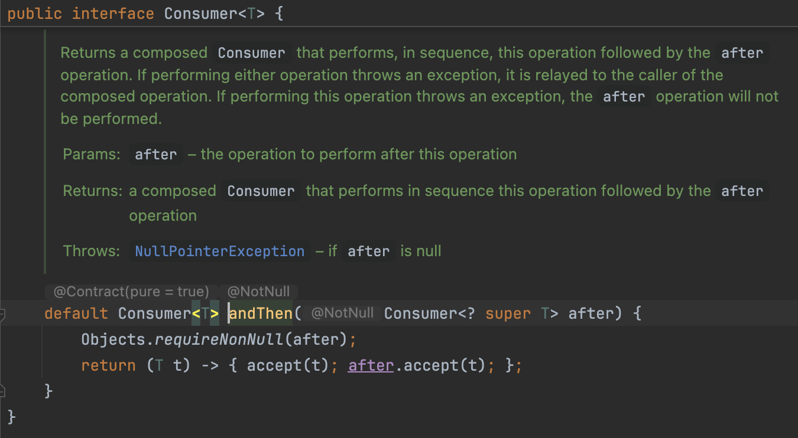

# Chaining Consumer

`Consumer<T>` interface has a default method called `andThen()`. Using this method we can chain consumers.

╰┈➤ This means that we can run many operations in sequence.


## `andThen()` method of Consumer\<T> interface

<figure><figcaption></figcaption></figure>

* This method takes a `Consumer` object called `after`.&#x20;
* First, it ensures that this argument `after` is not null.
* Then, it returns a lambda expression that represents a `Consumer` object.&#x20;
  * This lambda expression takes an argument of type `T`&#x20;
  * In the body, first it calls the `accept()` method of the current Consumer. So we are executing the current operation.&#x20;
  * Then, it calls the `accept()` method of the second Consumer; i.e. accept method of the `after` object.
* This is how 2 operations gets executed sequentially.&#x20;
* So, every time we call `andThen()` method we get a new `Consumer` and that means once again we can call `andThen()` method to execute another operation.


e.g:

```java
import java.util.List;
import java.util.function.Consumer;

public class LambdasDemo {
    public static void main(String[] args) {
        List<String> list2 = List.of("a", "b", "c");

        // Assign lambda expression that matches 
        //     the abstract method of the consumer interface to a Consumer
        Consumer<String> print = item -> System.out.print(item);
        // Here we are declaring an operation called `print` 
        //     that takes an item and print it on the terminal

        // Declare an operation that prints a string in UPPERCASE
        Consumer<String> printUppercase = item -> System.out.print(item.toUpperCase());

        // Iterate over list and in each iteration for each item call
        //      both operations mentioned above (print & printUppercase)
        //      in the order of print -> printUppercase -> print
        list2.forEach(print.andThen(printUppercase).andThen(print)); 
        // Output: aAabBbcCc
        
    }
}
```
