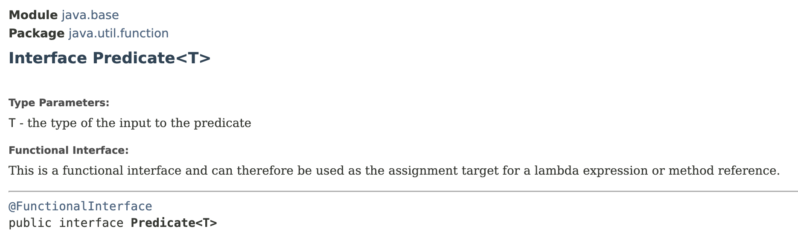
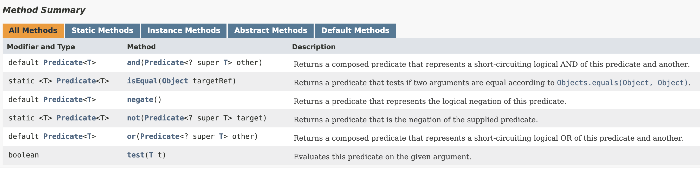

# Predicate Interface

## Predicate Interface

> **Represents an operation that takes an object and checks to see if that object satisfies some `criteria`**
>
> ╰┈➤ We use this in filtering data

e.g: With predicate interface, we can get the customers who don't have a phone number.

`Predicate<T>` interface has tons of applications in the real world.

<figure><figcaption></figcaption></figure>

<figure><figcaption></figcaption></figure>



This interface has a single abstract method called `test()`, we give it an object of type `T` and get a boolean.  So, in this method we can check to see if this object satisfies certain **criteria**.

* E.g: We can send it a `Customer` object and check to see if that customer has a balance.

<pre class="language-java"><code class="lang-java">import java.util.function.Predicate;

<strong>public class LambdasDemo {
</strong>    public static void main(String[] args) {
        // Check whether a string has more than 5 characters
        Predicate&#x3C;String> isLongerThan5 = str -> str.length() > 5;
        // Here, in the lambda expression we have a boolean expression to return a boolean value
        System.out.println(isLongerThan5.test("sky")); // Output: false
    }
}
</code></pre>

## Variations of `Predicate<T>` Interface

We have few specialisations of  `Predicate<T>` interface.

* [BiPredicate\<T,​U>](https://docs.oracle.com/en/java/javase/12/docs/api/java.base/java/util/function/BiPredicate.html)
  * it takes 2 arguments of type `T` and `U`  and then returns a boolean

We also have few **primitive specialisations** of `Predicate<T>` interface.

* [IntPredicate](https://docs.oracle.com/en/java/javase/12/docs/api/java.base/java/util/function/IntPredicate.html)&#x20;
  * takes a primitive integer and returns a boolean
* LongPredicate
* DoublePredicate

## Combining Predicates


[combining-predicates.md](combining-predicates.md)


