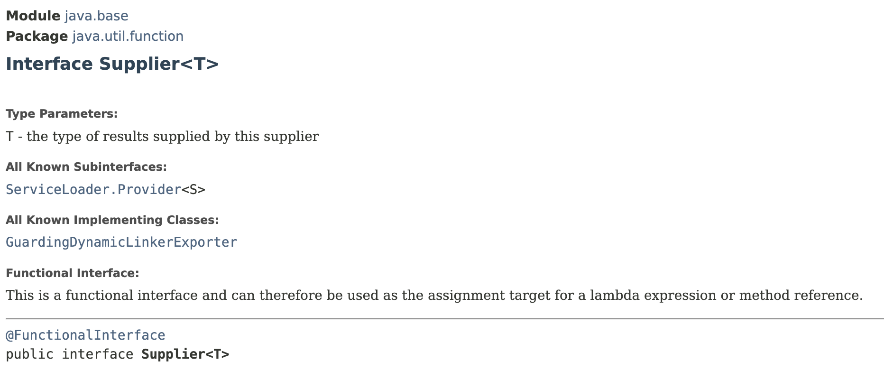
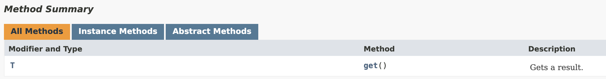

# Supplier Interface

> **Represents an operation that takes no input and returns a value**
>
> ╰┈➤ Supplies a value

<figure><figcaption></figcaption></figure>

<figure><figcaption></figcaption></figure>



`Supplier<T>` interface has only one abstract method `get()`; which return a value of type `T`.

This interface is also a functional interface, thus we can represent it using a **lambda expression**.

```java
import java.util.function.Supplier;

public class LambdasDemo {
    public static void main(String[] args) {
        Supplier<Double> getRandom = () -> Math.random();
        // This lambda expression represent a function;
        // Lazy evaluation:
        //      this function is not executed, until we explicitly call it;
        //      i.e. value is not generated until we explicitly ask for it.

        System.out.println(getRandom.get());
    }
}
```

## Variations of `Supplier<T>` Interface

Like Consumer interface, Supplier interface also has some specialisations for working with primitive values.

1. DoubleSupplier
2. IntSupplier
3. LongSupplier
4. BooleanSupplier

✅️ If you are working with primitive values, prefer to use these **`primitive specialisations`** of the `Supplier` interface.

╰┈➤ Because you don't pay the cost of **auto boxing** primitive value inside a reference type and then **unboxing** it later on.

