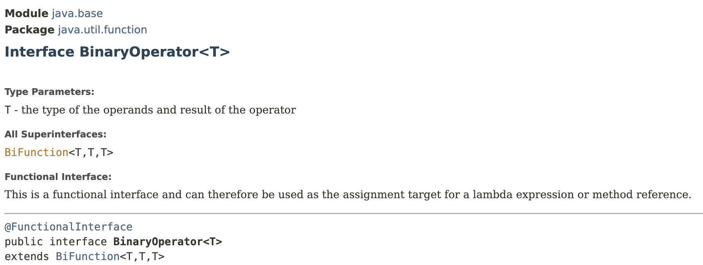

# The BinaryOperator Interface

## BinaryOperator Interface

> extends the `BiFunction<T,T,T>` interface; a special type of `Function`.
>
> **A `Function` that takes 2 arguments of type `T` and returns a result of type `T`.**

<pre class="language-java"><code class="lang-java">var x = 2 <a data-footnote-ref href="#user-content-fn-1">+</a> 1;
</code></pre>

Here, the `+` operator is an example of `Binary Operator`; it has 2 operands; 2 and 1 and returns a single result.


<figure><figcaption></figcaption></figure>



```java
import java.util.function.BinaryOperator;
import java.util.function.Function;

public class LambdasDemo {
    public static void main(String[] args) {
        // a, b -> a+b -> square (a+b)
        
        BinaryOperator<Integer> add = (a, b) -> a + b; // ------------ A
        System.out.println(add.apply(2, 3)); // Output: 5

        Function<Integer, Integer> square = (a) -> a * a;

        var result = add.andThen(square).apply(2, 3);
        System.out.println(result); // Output: 25
    }
}
```

❗Here, @A, we are dealing with primitive integers. And these have to be auto boxed inside instances of the Integer class. Thus, if you are dealing with large number of primitive integers, it is more efficient to use **`IntBinaryOperator`** interface.


## Variations of `BinaryOperator<T>` Interface

We have **primitive specialisations** of BinaryOperator Interface.

* [IntBinaryOperator](https://docs.oracle.com/en/java/javase/12/docs/api/java.base/java/util/function/IntBinaryOperator.html)
  * takes 2 primitive integers and returns a primitive integer


[^1]: Example of Binary Operator;

    it has 2 operands; 2 and 1 and returns a single result
