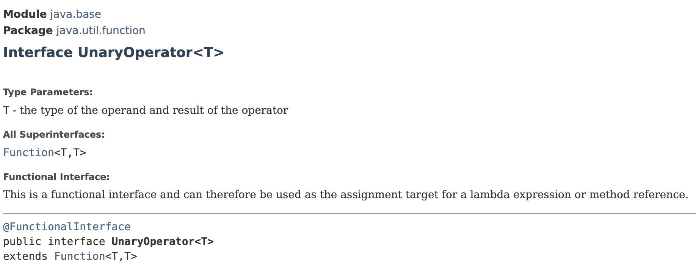

# The UnaryOperator Interface

## UnaryOperator Interface

> extends the `Function<T,T>` interface; a special type of `Function`.
>
> **A `Function` that takes an argument of type `T` and returns a value of type `T`.**


<figure><figcaption></figcaption></figure>



```java
import java.util.function.UnaryOperator;

public class LambdasDemo {
    public static void main(String[] args) {
        UnaryOperator<Integer> add5 = a -> a + 5;
        UnaryOperator<Integer> decrement = a -> a - 1;

        System.out.println(add5.andThen(decrement).apply(2)); // Output: 6
    }
}
```


