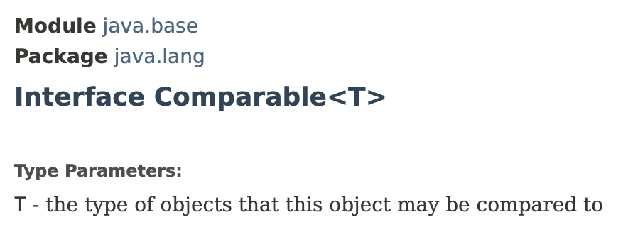
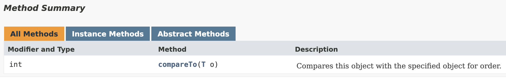

# Functional Interfaces


> Functional Interface
>
> \-> **An interface with a single abstract method**

It doesn't matter even if we have many static, private, default methods in the interface. As long as it has a single abstract method, it is a **`functional interface`**.

e.g:&#x20;

* Comparable Interface -> has only one abstract method
* Comparator Interface -> has only one abstract method

<div align="left">

<figure><figcaption></figcaption></figure>

</div>

<figure><figcaption></figcaption></figure>

```java
// A Functional Interface - has a single abstract method
public interface Printer {

    // An abstract method
    void print(String message);

    // Default method
    default void printTwice(String message) {
        System.out.println(message);
        System.out.println(message);
    }
}

public class ConsolePrinter implements Printer {
    @Override
    public void print(String message) {
        System.out.println(message);
    }
}

public class Main {
    public static void main(String[] args) {
        greet(new ConsolePrinter());

    }

    public static void greet(Printer printer) {
        printer.print("Hello World!");
    }
}
```

Sometimes we don't wanna explicitly create a class to implement an interface.&#x20;

* It requires writing a bit of code.&#x20;
* Sometimes we may not want to reuse this class.

╰┈➤ **`Anonymous Inner Classes`** come in handy in this kind of scenarios.
