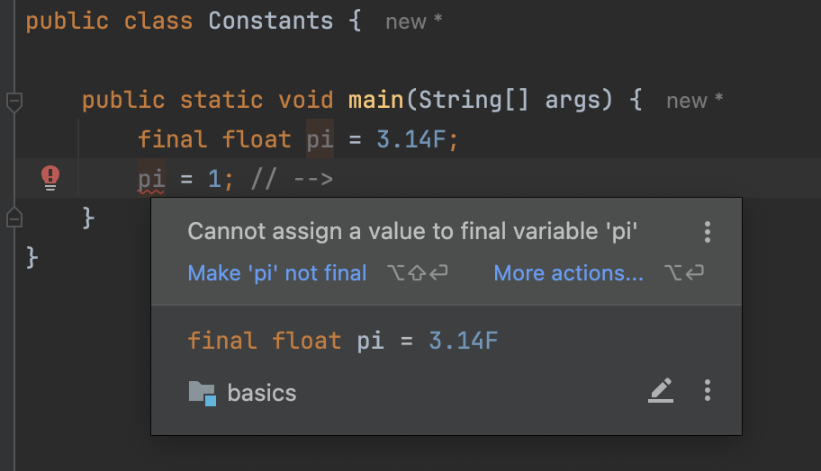

# Constants

> **Use `final` variables when value of a variable should be fixed; unchangeable.**

ℹ️ `Final variables` -> cannot change once set

<pre class="language-java"><code class="lang-java">final float <a data-footnote-ref href="#user-content-fn-1">PI</a> = 3.14F;
</code></pre>

When a variable is declared as a final it cannot be changed thereafter.

If you try to change it, it gives a compilation error.

<div align="left"><figure><figcaption></figcaption></figure></div>

By convention, we use `all uppercase` letters to name constants and words are separated with underscores (`_`).

```java
final float PI = 3.14F;
// PI = 1; // --> Compilation Error
System.out.println(PI);
```


[^1]: uppercase letters
