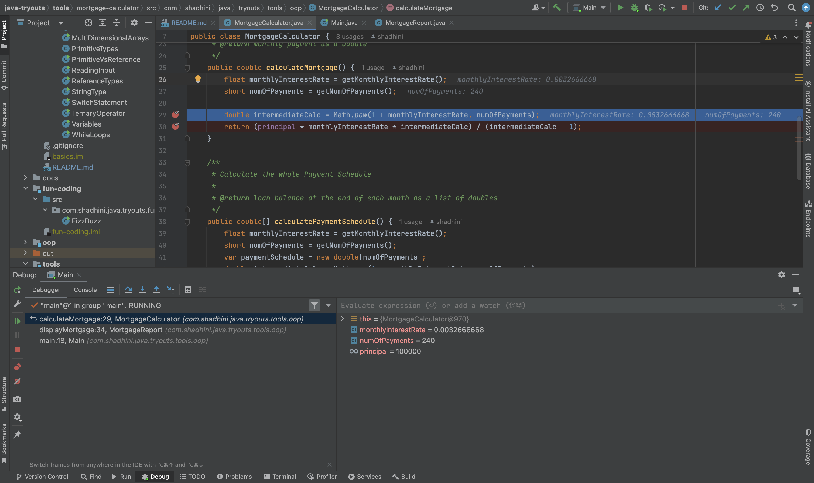

# Debugging Java Applications

Java `breakpoints` will stop the execution @ the breakpoint before executing that line.

<figure><figcaption></figcaption></figure>

## Using IntelliJIDEA IDE


[Refactoring](https://app.gitbook.com/s/iwMVoASPXjxvpeNiNKj4/intellijidea/refactoring)



[Debugging](https://app.gitbook.com/s/iwMVoASPXjxvpeNiNKj4/intellijidea/debugging)


