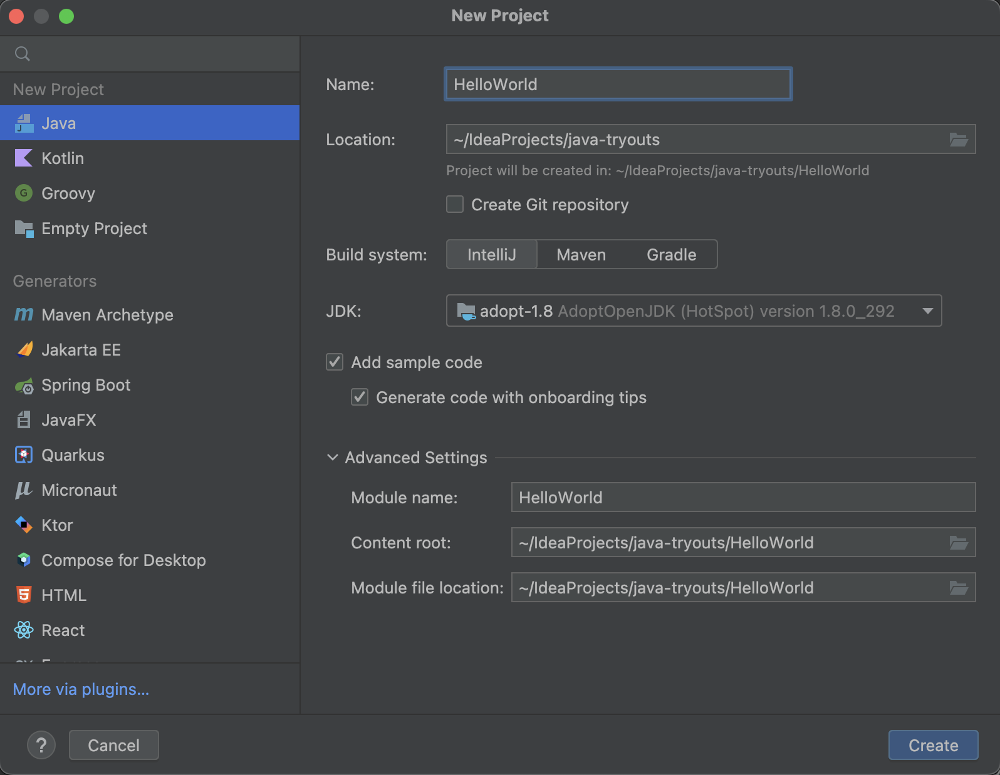
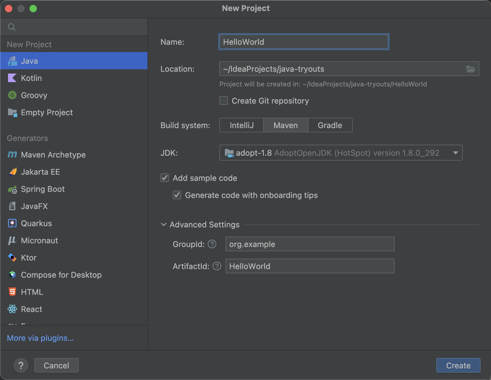
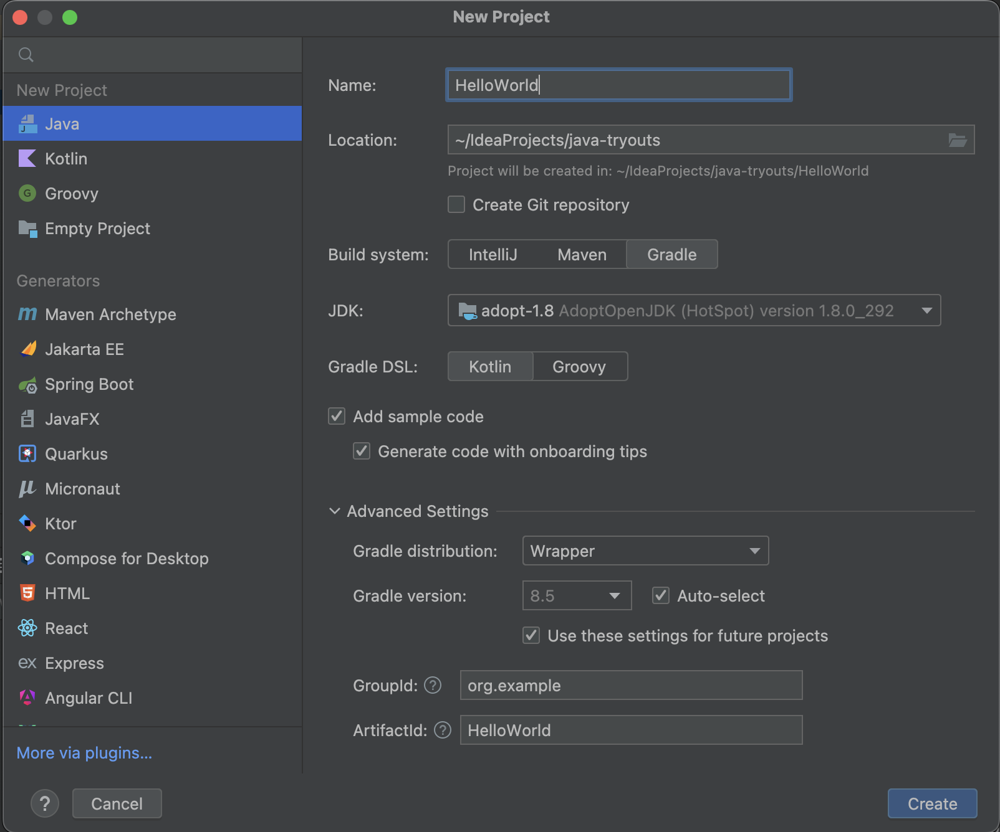
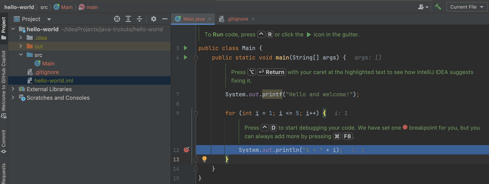
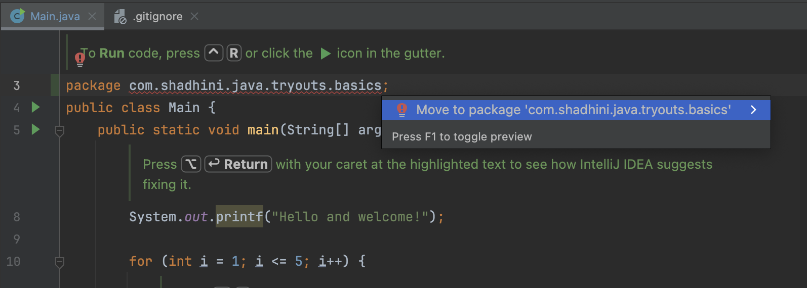
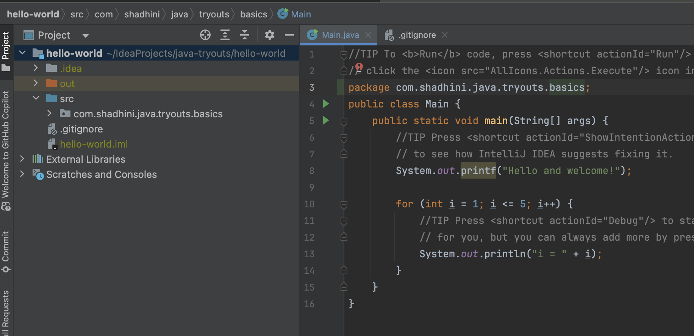
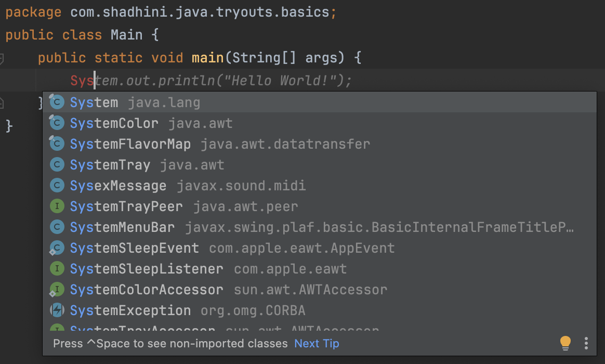
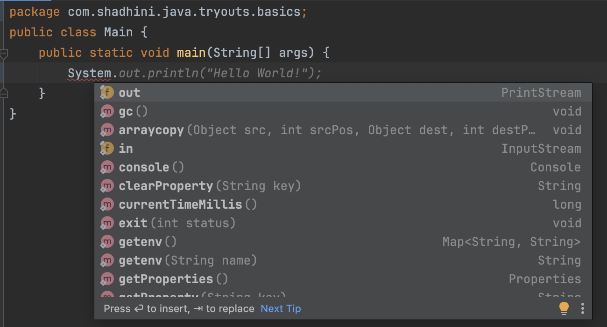
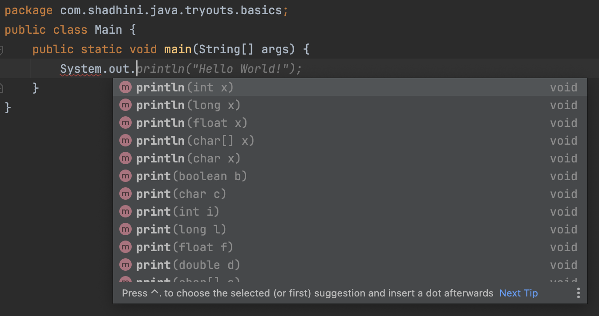

# First Java Program

## @IntelliJIDEA   &#x20;

1.  File -> New Project --> Java \[left panel]

    \[right panel]&#x20;

    1. Name: project name
    2. Location: project location
    3. JDK: Select JDK  (AdoptOpenJDK 11.0.11 preferred)
    4. Build System
       1. If `IntelliJ` selected.
          1. \-> Create
       2. If `maven` or `gradle` selected,&#x20;
          1. **GroupId**: the base package; base package for a Java project is the domain name of the comapny in reverese; (e.g: com.shadhini.java.tryouts.basics) -- now every class we create in this project will belong to this package&#x20;
          2. **ArtifactId**:  artifact name

With `IntelliJ` as Build System

<figure><figcaption></figcaption></figure>

With `Maven` as Build System

<figure><figcaption></figcaption></figure>

With `gradle` as a Build System

<figure><figcaption></figcaption></figure>

## After creating the project with `IntelliJ` as build system

<figure><figcaption></figcaption></figure>

## Adding package after creating the project with \`IntelliJ\` as build system

<figure><figcaption></figcaption></figure>

<figure><figcaption></figcaption></figure>

## About First Java Program

<figure><figcaption>
Call <code>System</code> class from java.lang package
</figcaption></figure>

<figure><figcaption>
Check accessible members of <code>System</code> class
</figcaption></figure>

<figure><figcaption>
Check accessible members of <code>out</code> filed of type <code>PrintStream</code>
</figcaption></figure>

<pre class="language-java"><code class="lang-java">package com.shadhini.java.tryouts.basics;

public class Main {
    <a data-footnote-ref href="#user-content-fn-1">public</a> <a data-footnote-ref href="#user-content-fn-2">static</a> <a data-footnote-ref href="#user-content-fn-3">void</a> main(<a data-footnote-ref href="#user-content-fn-4">String[] args</a>) {
        <a data-footnote-ref href="#user-content-fn-5">System</a>.<a data-footnote-ref href="#user-content-fn-6">out</a>.<a data-footnote-ref href="#user-content-fn-7">println</a>(<a data-footnote-ref href="#user-content-fn-8">"Hello World!"</a>);
    }
}
</code></pre>

### Note

* All Java files should have the `.java` extension.

[^1]: accessible from other parts of the program

[^2]: Main method in the program should always be `static`.

[^3]: return type; this method won't return any value

[^4]: one parameter

[^5]: a class defined in the java.lang package

[^6]: field of `System` class of type `PrintStream`; `PrintStream` is another class defined in Java

[^7]: method of `PrintStream` class

[^8]: a string
