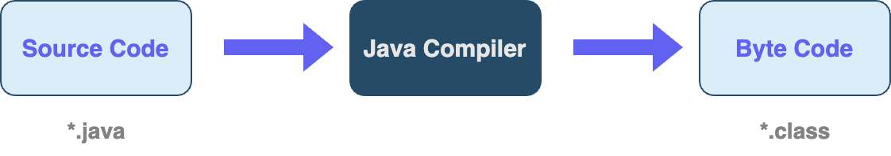
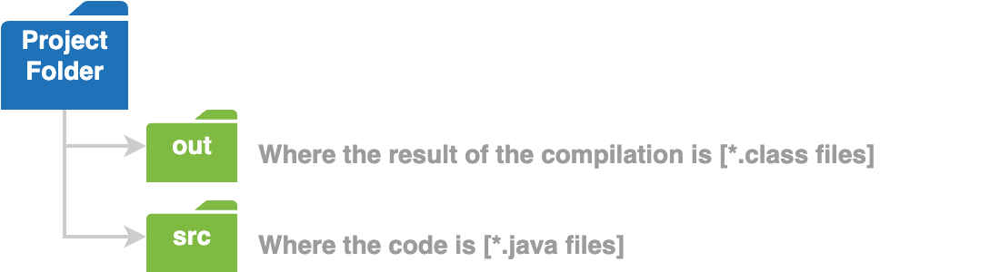
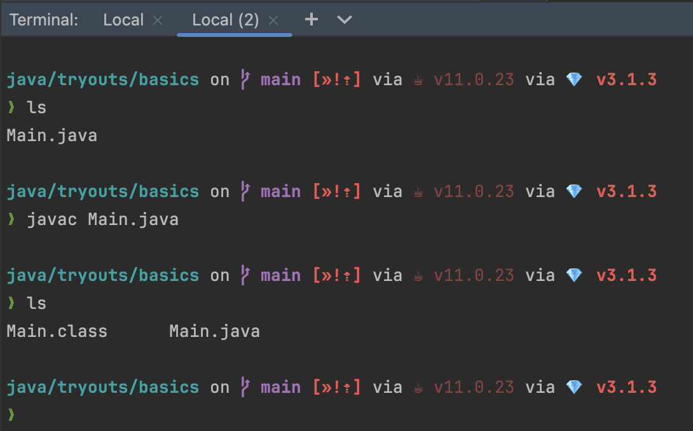
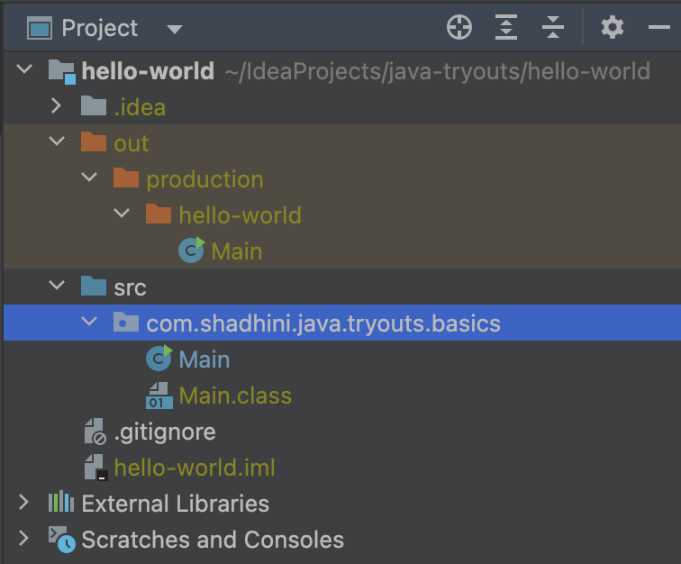
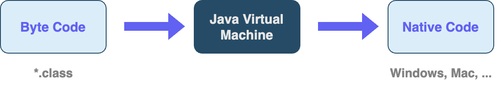
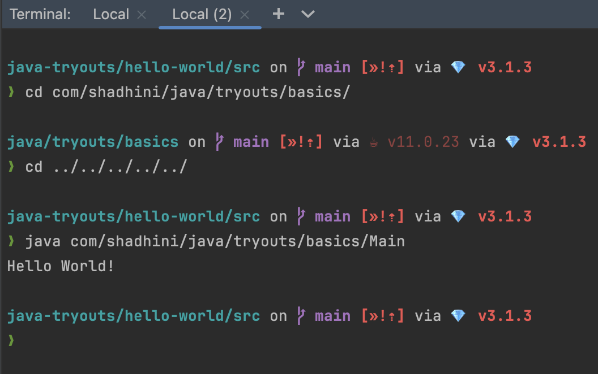

# How Java Code gets Executed

## Step 1 - Compilation

<figure><figcaption></figcaption></figure>

IntelliJ uses `Java compiler` to compile the code (`source code`) into a different format called `Java Byte Code`.

The `Java Byte Code` with `*.class` extension is **platform independent**; i.e. it can run on any operating system that has `JRE` (Java Runtime Environment).

This `Java complier` comes with the `Java Development Kit (JDK)`.


### Invoke Java Compiler to generate Byte Code

Java compiler can be invoked with `javac` command.

```
javac <JAVA_FILE_NAME>.java
```

<figure><figcaption></figcaption></figure>

E.g:

<figure><figcaption></figcaption></figure>

<figure><figcaption></figcaption></figure>

## Step 2 - Execution

<figure><figcaption></figcaption></figure>

`JRE` (Java Runtime Environment) can be downloaded for various operating systems.

This JRE has a software component called `Java Virtual Machine` (`JVM`).

JVM takes `byte code` and translate it to the `native code` for the underlying operating system.

This architecture is what makes Java applications **`portable`** or **`platform independent`**.

* A Java program can be developed on Mac and then can be executed on any other operating system (OS) which has `JRE`.
* `C#` and `Python` also have the same architecture. That is why they are platform independent.


### Invoke JVM to run Java program

```
java <FULL_PATH_FOR_.class_FILE_WITHOUT_EXTENSION>
```

E.g:

<figure><figcaption></figcaption></figure>

## NOTE

* When the program is run using the IntelliJIDEA IDE, these steps are hidden from us.

