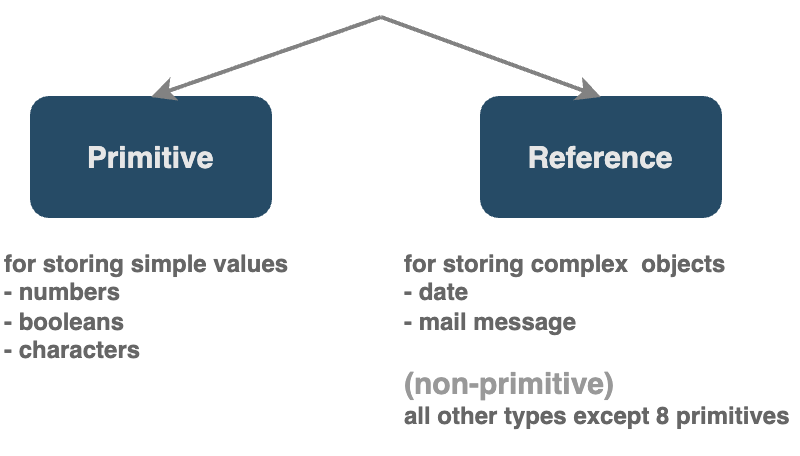

# Types

<figure><figcaption></figcaption></figure>


[Primitive Types](https://app.gitbook.com/s/iwMVoASPXjxvpeNiNKj4/basics/types/primitive-types)



[Reference Types](https://app.gitbook.com/s/iwMVoASPXjxvpeNiNKj4/basics/types/reference-types)



[Memory Management: Primitive types & Reference types](https://app.gitbook.com/s/iwMVoASPXjxvpeNiNKj4/basics/types/memory-management-primitive-types-and-reference-types)



[Primitive Types vs Reference Types](https://app.gitbook.com/s/iwMVoASPXjxvpeNiNKj4/basics/types/primitive-types-vs-reference-types)



[Strings \[java.lang.String\]](https://app.gitbook.com/s/iwMVoASPXjxvpeNiNKj4/basics/types/strings-java.lang.string)



[arrays.md](arrays.md)



[multi-dimensional-arrays.md](multi-dimensional-arrays.md)


