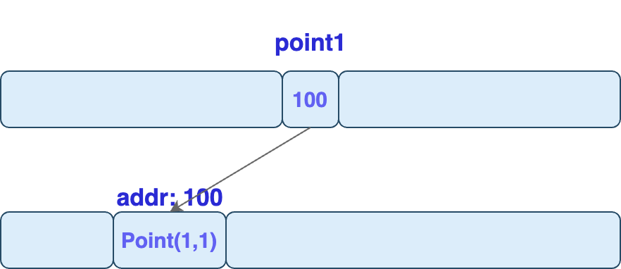
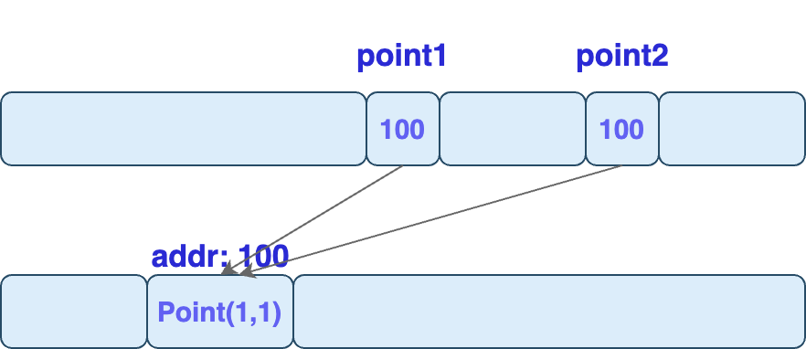

# Memory Management: Primitive types & Reference types

> **Primitive Types**
>
> * Memory allocation & release -> by JRE on stack
>
> **Reference Types**
>
> * Memory allocation -> by Developer on stack and heap
> * Memory release/ deallocation -> by JRE on stack and heap (@heap by Garbage Collection)

When declaring **Primitive Types**, we don't need to allocate memory.

* Memory is `allocated` and `released` by `JRE` (Java Runtime Environment) .

But, when dealing with **Reference Types**, we should always `allocate` memory.

* But we don't have to `release` that memory. `JRE` will automatically take care of that.





## Primitive Types

```java
// Primitive Types
byte x = 1;
byte y = x;
```

These 2 variables are stored at different memory locations.&#x20;

So they are **`completely independent of each other`**.

<div align="left"><figure><figcaption></figcaption></figure></div>

If you change the value of x, y is not affected.

```java
x = 2;
```

<div align="left"><figure><figcaption></figcaption></figure></div>


## Reference Types

```java
// Reference Types
Point point1 = new Point(1, 1);
```

Here, memory is allocated to store this `Point` object.

* Say, address of that memory location is `100`.&#x20;
* Then it's going to allocate a separate part of the memory and it's going to attach this label `point1` to that memory location.&#x20;
* In that memory location, it's going to store the address of the `Point` object.

<div align="left"><figure><figcaption></figcaption></figure></div>

```java
Point point2 = point1;
```

Here `point1` and `point2` are  referencing the exact same `Point` object in the memory.

* Thus, these 2 variables, `point1` and `point2` are **`not independent form each other`**.

<div align="left"><figure><figcaption></figcaption></figure></div>

```java
point1.x = 3;
// point1 = java.awt.Point[x=3,y=1]
// point2 = java.awt.Point[x=3,y=1]
```

This means, if this `Point` object is updated through either of these variables, the changes will be visible to the other variable.


## More on Memory Allocation...


[memory-allocation.md](../../oop/memory-allocation.md)



