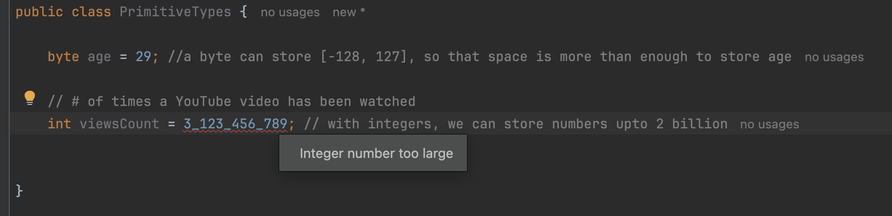
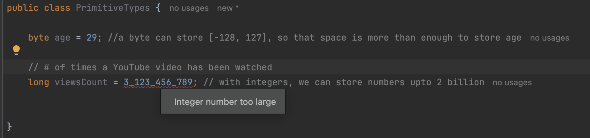
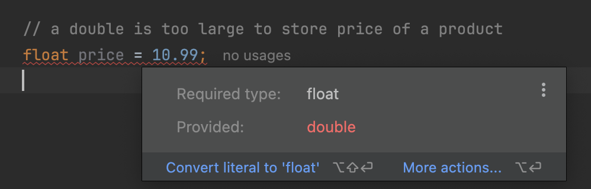

# Primitive Types

> **for storing simple values**
>
> * numbers
> * booleans&#x20;
> * characters

<table data-full-width="false"><thead><tr><th width="329" align="center"></th><th width="93" align="center">Type</th><th width="76" align="center">Bytes</th><th>Range</th></tr></thead><tbody><tr><td align="center">[<code>whole numbers</code>]</td><td align="center">byte</td><td align="center">1</td><td>[-128, 127]</td></tr><tr><td align="center">[<code>whole numbers</code>]</td><td align="center">short</td><td align="center">2</td><td>[-32K, 32K]</td></tr><tr><td align="center">[<code>whole numbers</code>]</td><td align="center">int</td><td align="center">4</td><td>[-2B, 2B]</td></tr><tr><td align="center">[<code>whole numbers</code>]</td><td align="center">long</td><td align="center">8</td><td></td></tr><tr><td align="center">[<code>numbers with decimal points</code>]</td><td align="center">float</td><td align="center">4</td><td></td></tr><tr><td align="center">[<code>numbers with decimal points</code>]</td><td align="center">double</td><td align="center">8</td><td></td></tr><tr><td align="center">[<code>international letters</code>]</td><td align="center">char</td><td align="center">2</td><td>A, B, C .....</td></tr><tr><td align="center"></td><td align="center">boolean</td><td align="center">1</td><td>true, false</td></tr></tbody></table>





## int & long

* `int` type can only store integers which are whole numbers that don't have a decimal point
* In Java, when you deal with a very large number, you can use `_` to separate every 3 digits.

```java
int viewCount = 123_456_789;
```

* Following raises the error `Integer number too larger`.

<figure><figcaption></figcaption></figure>

* But, the same error is raised when the variable type is modified to `long` as follows.
  * Reason: By default, Java compiler sees this value as an integer and it thinks this value is too large for an integer.&#x20;
  * Solution: To solve this issue, we need to add `L`  or `l` as a suffix to this number. Use of `L` is recommended.

<figure><figcaption></figcaption></figure>

## float & double

* Following raises the `Incompatible type error`.
  * Reason: By default, Java sees these numbers with a decimal point as `double`, so even though we set the type of this variable to `float`, the Java sees it as a double.
  * Solution: To solve this issue, we need to add `f` or `F` as suffux to this number to represent it as a `float`.

<figure><figcaption></figcaption></figure>

## char

*   A single character should always be surrounded with single quotes (`' '`).

    ```
    'A'
    ```


