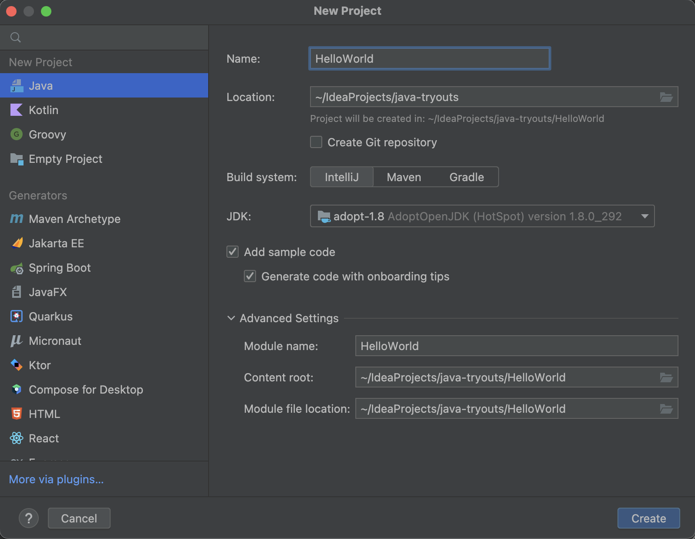
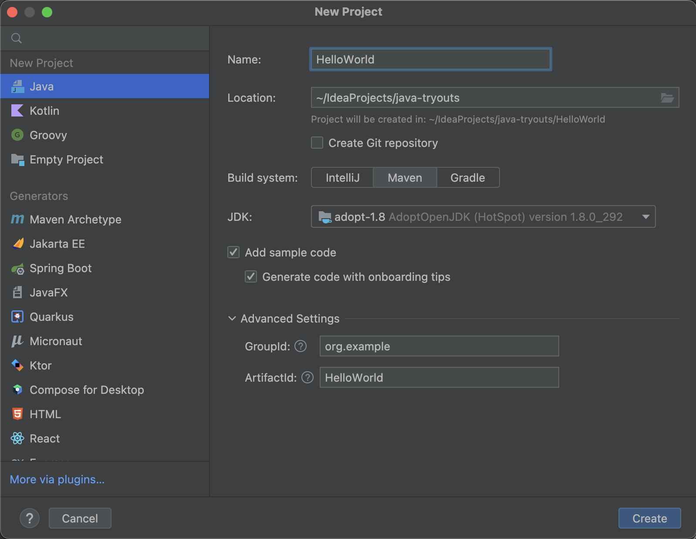
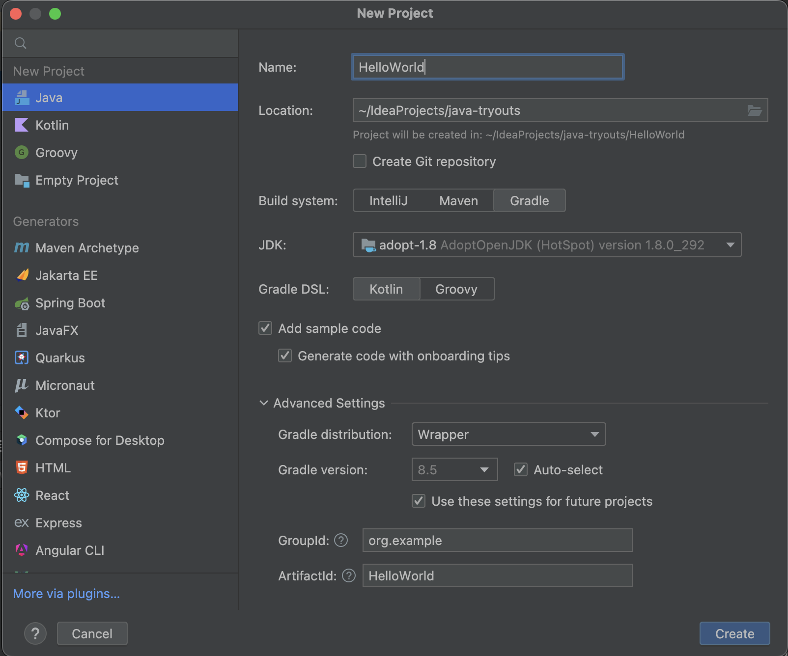
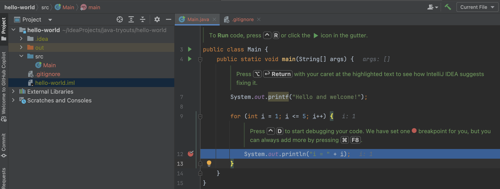
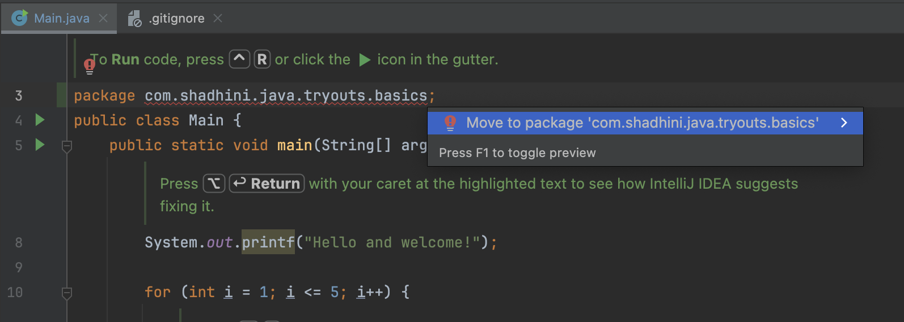
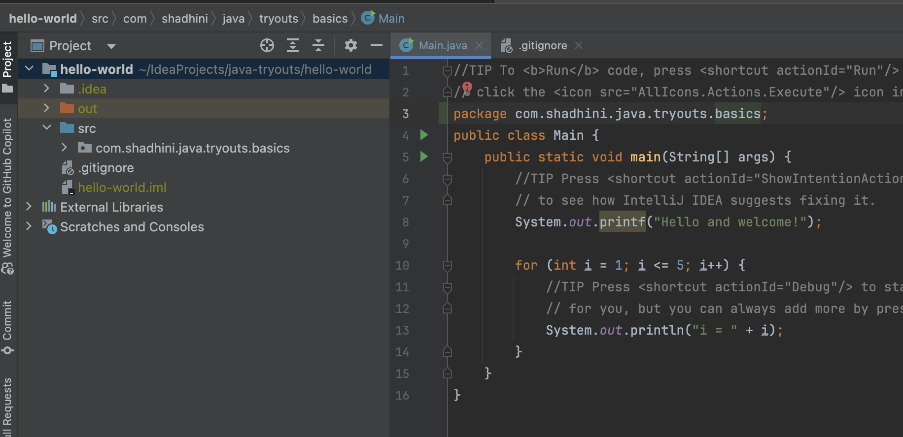

# Create New Project

1.  File -> New Project --> Java \[left panel]

    \[right panel]&#x20;

    1. Name: project name
    2. Location: project location
    3. JDK: Select JDK  (AdoptOpenJDK 11.0.11 preferred)
    4. Build System
       1. If `IntelliJ` selected.
          1. -> Create
       2. If `maven` or `gradle` selected,&#x20;
          1. **GroupId**: the base package; base package for a Java project is the domain name of the comapny in reverese; (e.g: com.shadhini.java.tryouts.basics) -- now every class we create in this project will belong to this package&#x20;
          2. **ArtifactId**:  artifact name

With `IntelliJ` as Build System

<figure><figcaption></figcaption></figure>

With `Maven` as Build System

<figure><figcaption></figcaption></figure>

With `gradle` as a Build System

<figure><figcaption></figcaption></figure>

## After creating the project with `IntelliJ` as build system

<figure><figcaption></figcaption></figure>

## Adding package after creating the project with \`IntelliJ\` as build system

<figure><figcaption></figcaption></figure>

<figure><figcaption></figcaption></figure>
