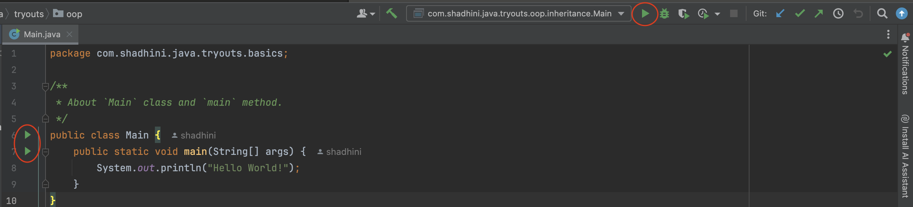
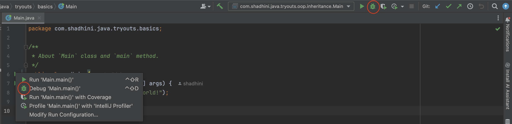
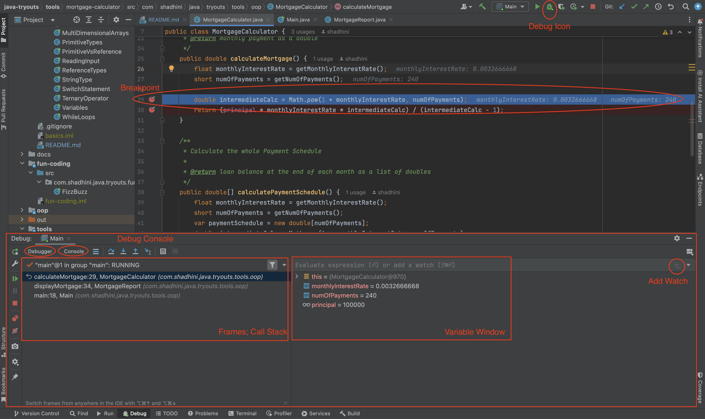
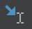
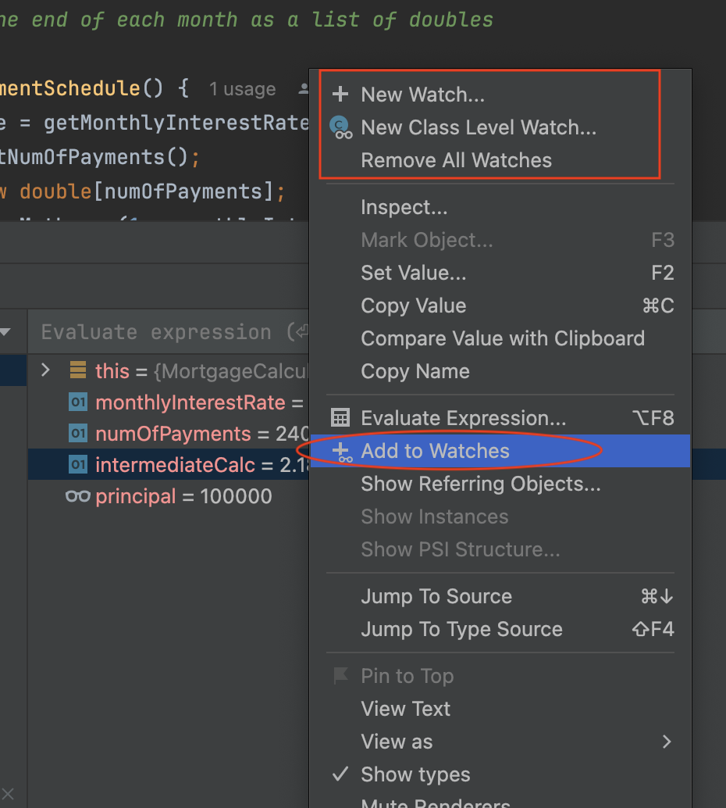
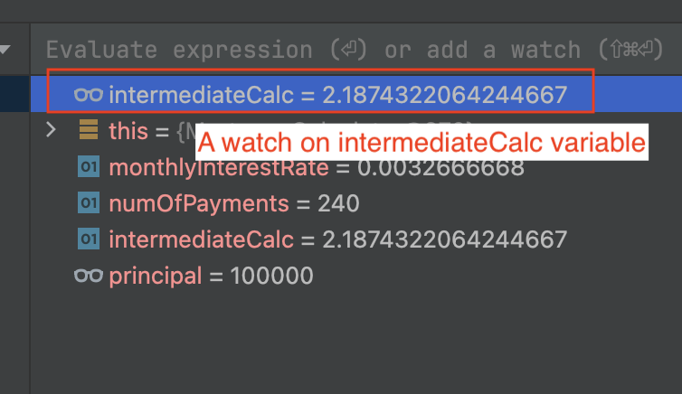
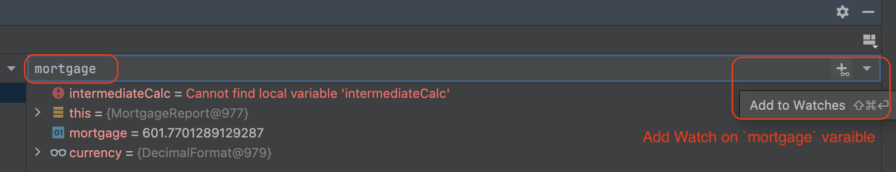
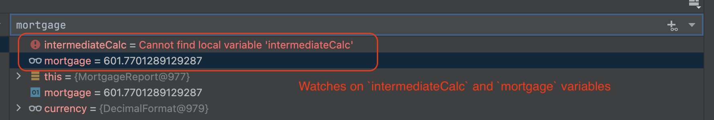
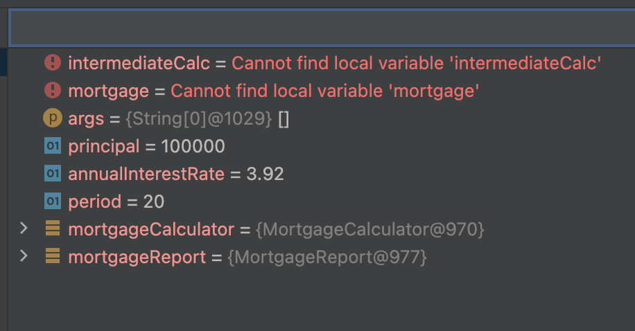

# Debugging

## ▶️ Run & 🐞 Debug

Execute/Run a program:   `control ^` + `R`

<figure><figcaption>
Note red circles for <code>Run</code> icon
</figcaption></figure>

Debug a program: `control ^` + `D`

<figure><figcaption>
Note red circles for <code>Debug</code> icon
</figcaption></figure>

Debug Breakpoints Console: `command` + `fn` + `shift` + `F8`

## 🐞 Debugging

<figure><figcaption></figcaption></figure>

<figure><figcaption>
IntelliJ - Debug Console
</figcaption></figure>

<table><thead><tr><th width="152">Feature</th><th width="201">Icon | Shortcut</th><th>Description</th></tr></thead><tbody><tr><td>Debug</td><td> OR <code>control</code> + <code>D</code>  </td><td>Start debugging session</td></tr><tr><td>Step Over</td><td> </td><td>Execute line by line</td></tr><tr><td>Step Into</td><td> OR <code>F7</code></td><td>Step into a method</td></tr><tr><td>Step Out</td><td></td><td>Step out of current methid</td></tr><tr><td>Re run</td><td></td><td>Re run the program from the beginning and stop at the first breakpoint</td></tr><tr><td>Run to Cursor</td><td></td><td>Run the program until it reaches the line where cursor is at</td></tr><tr><td>Stop</td><td></td><td>Terminate the debug session</td></tr></tbody></table>

## Call Stack | Frames

Shows all the methods that are called in the reverse order.

## Watches

<figure><figcaption>
Add watch on variable <code>intermediateCalc</code> by selecting it on variable window
</figcaption></figure>

<figure><figcaption>
Watch on <code>intermediateCalc</code> variable
</figcaption></figure>

<figure><figcaption>
Add watch on <code>mortgage</code> variable by typing it in the watches input bar
</figcaption></figure>

<figure><figcaption>
Watches on <code>intermediateCalc</code> and <code>mortgage</code> variables
</figcaption></figure>

<figure><figcaption>
Watches on <code>intermediateCalc</code> and <code>mortgage</code> variables
</figcaption></figure>

