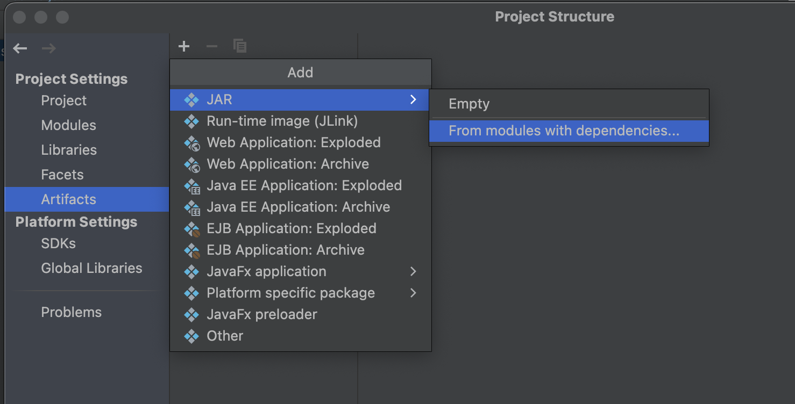
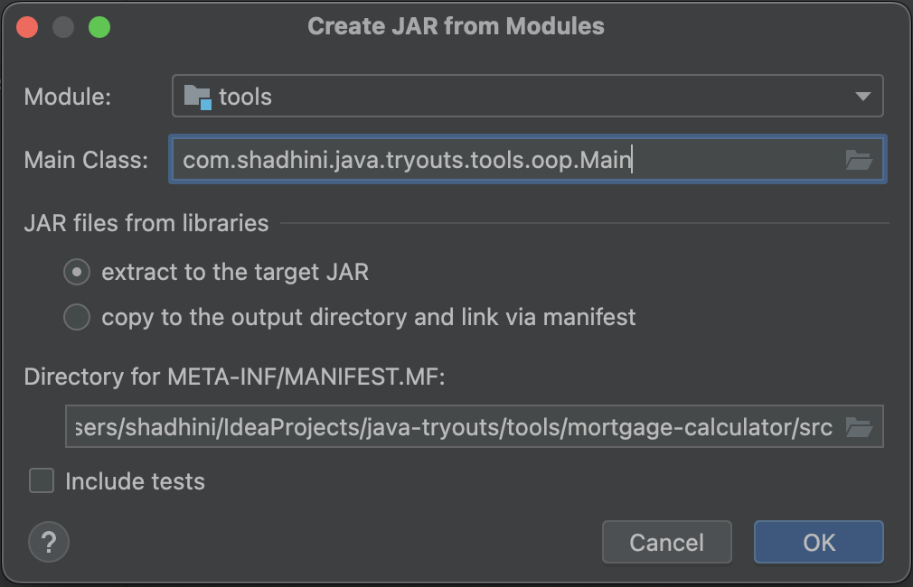
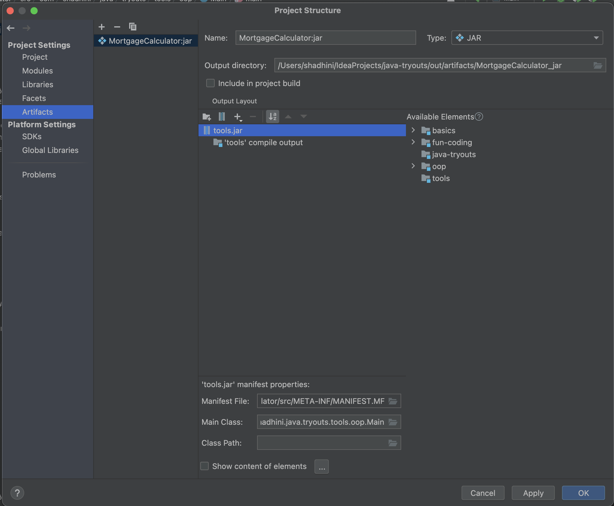
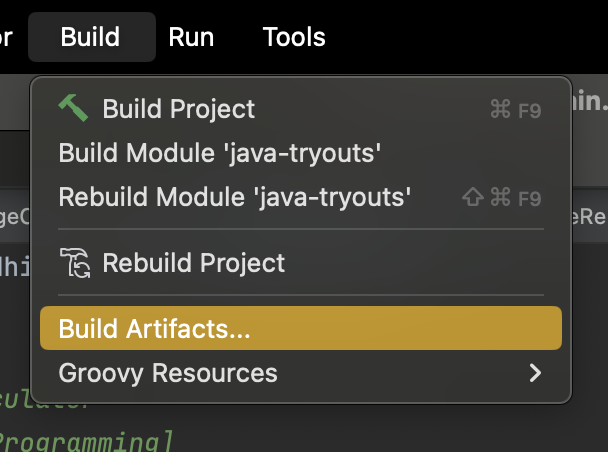
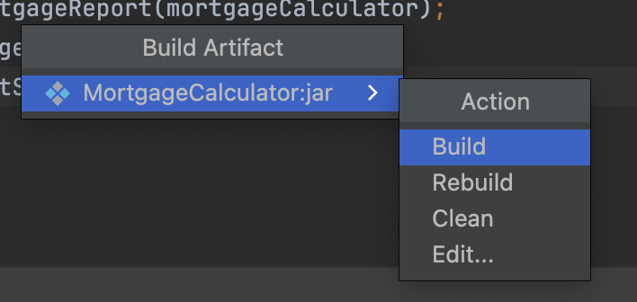
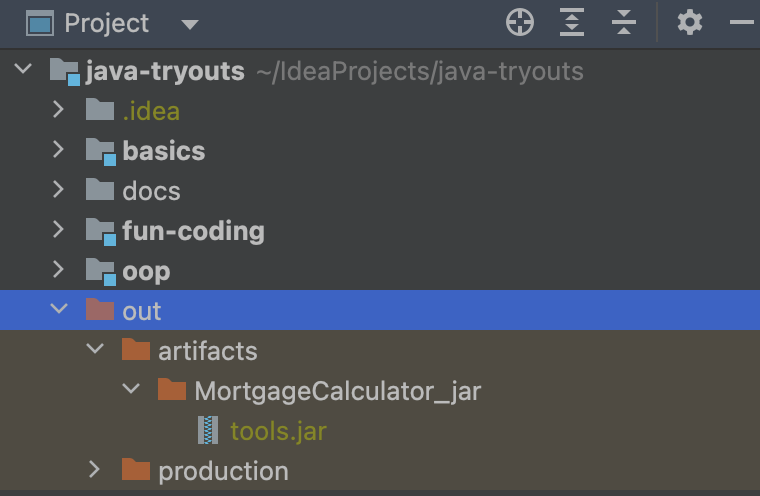

# Packaging Java Applications

@IntelliJIDEA IDE,

File -> Project Structure -> Project Settings&#x20;

-> Artifacts

1. -> +JAR
   * JavaFx Application -- platform for creating desktop applications
2. -> From modules with dependencies
   * module
   * main class
3. OK

<figure><figcaption></figcaption></figure>

<figure><figcaption></figcaption></figure>

<figure><figcaption></figcaption></figure>

***

Build -> Build Artifacts -> Select the artifact

* Build/ Rebuild/ Clean

<figure><figcaption></figcaption></figure>

<figure><figcaption></figcaption></figure>

***

@Project panel

-> out -> artifacts -> ...... -> `*_jar` -> `*.jar`

<figure><figcaption></figcaption></figure>

