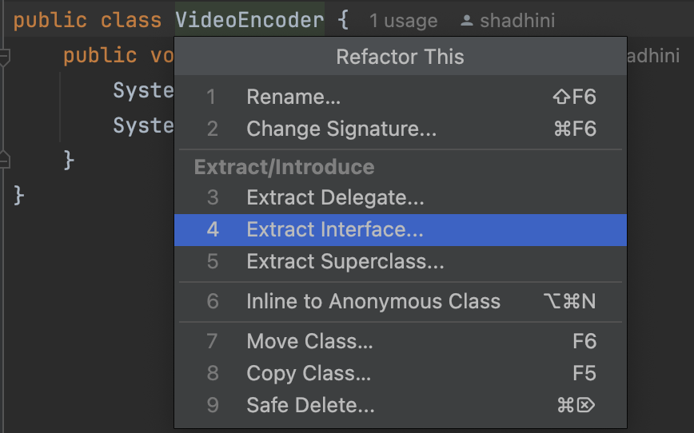
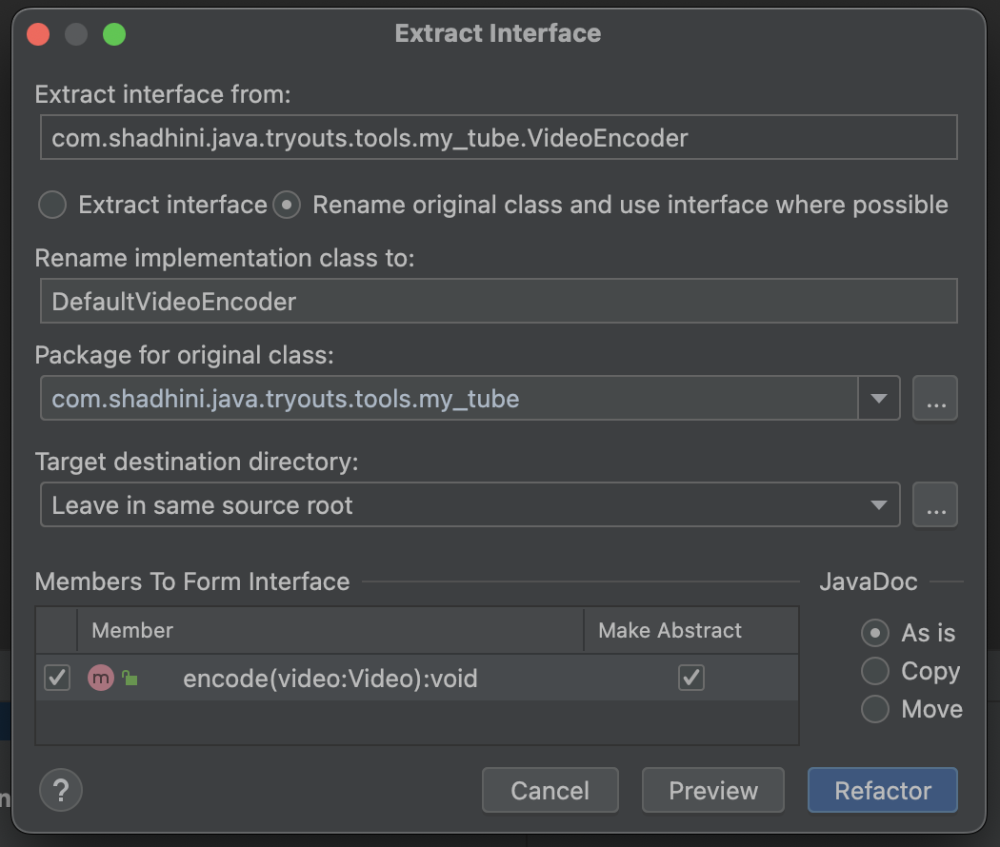
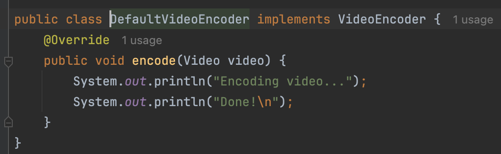
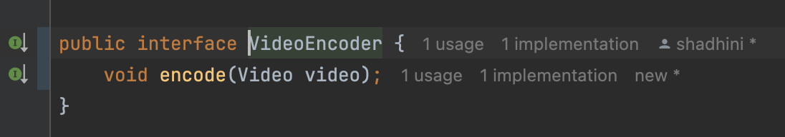

# Refactoring

## IntelliJ Refactor Functionality

cursor on the member name -> Refactor -> Refactor This &#x20;

OR&#x20;

cursor on method name -> `control` + `T`

#### Extract code to a new method.

1. select the lines need to be extracted
2. right click -> Refactor -> Extract Method

#### Move members to another class

1. Visibility -> .....

#### Extract field from local variable

#### Convert methode to  instance method

#### Move method to another interface

#### Extract interface and implementation from a class

<figure><figcaption></figcaption></figure>

<figure><figcaption></figcaption></figure>

<figure><figcaption></figcaption></figure>

<figure><figcaption></figcaption></figure>

