# Shortcuts

## 💬 Comments&#x20;

Line comment: cursor on line ->  `command` + `/`&#x20;

Line comments on multiple lines: select multiple lines ->  `command` + `/`&#x20;

Doc comment: type `/**` -> return

Multiple line comment: type `/*` -> return


## 💡View Hints; Bulb Options; Suggestions @ Cursor

`option` + `return`

Can be used to&#x20;

* surround a checked exception with try catch block
* to add variable declaration&#x20;
* and many more ...

## 📑 Duplicate Code

Select the code snippet to be duplicated.

`command` + `D`


## 🔀 Move Code Snippets

Move Up: `shift` + `option` + `↑`

Move Down: `shift` + `option` + `↓`


## 🔎 Navigation & Search&#x20;

Navigate to method declaration: `command` + `B`

See method parameter info: `command` + `P`&#x20;


## 💻 Quick Code Snippet Generation

To generate following code snippet of `main` method,&#x20;

```java
public static void main(String[] args) {
        
}
```

type `psvm` and press `return`

<div align="left">

<figure>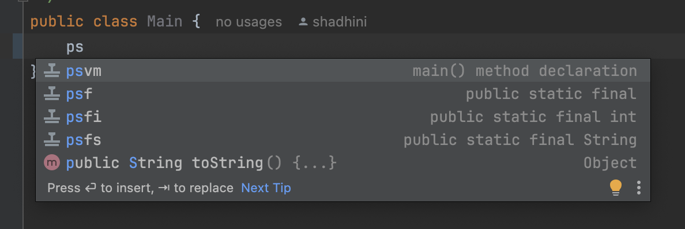<figcaption></figcaption></figure>

</div>

***

To generate following code snippet to print a string,

```java
System.out.println();
```

type `sout` and press `return`

<div align="left">

<figure>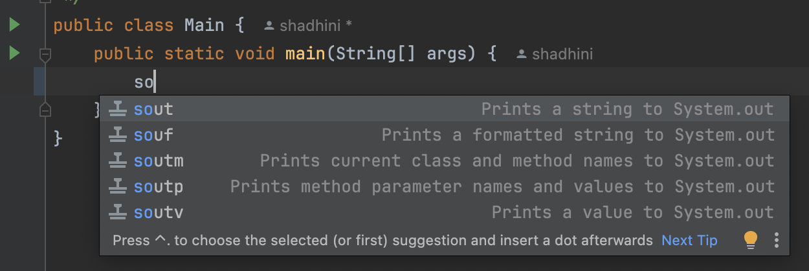<figcaption></figcaption></figure>

</div>

***

## 🛠️ Generate Getters Setters & Constructors, Override Methods inherited, Override equals() and hashCode() methods based on the content

1. put the cursor at the field declaration
2. check options with `Option` + `return`

OR

1. Code  -> Generate

OR

1. `Command` + `N`


### Method Overriding

<div align="left">

<figure>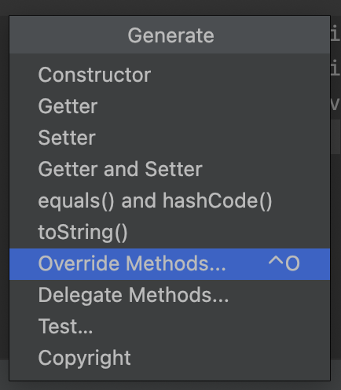<figcaption></figcaption></figure>

 

<figure>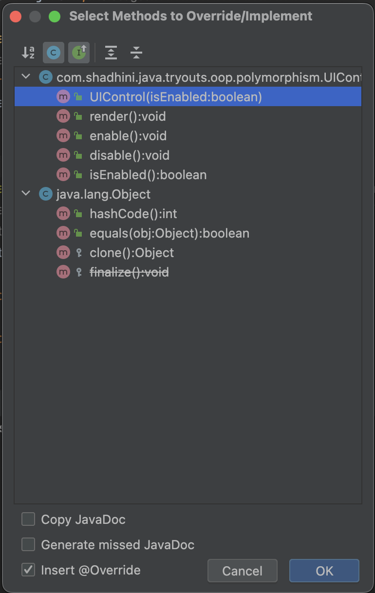<figcaption></figcaption></figure>

</div>

## ƒ Create Method

<div align="left">

<figure>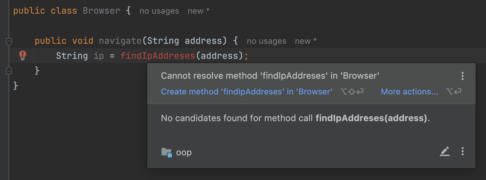<figcaption></figcaption></figure>

</div>

<div align="left">

<figure>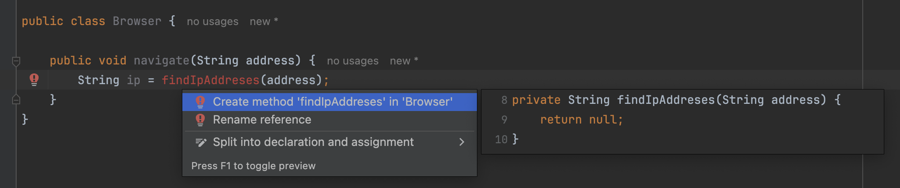<figcaption></figcaption></figure>

</div>

<div align="left">

<figure>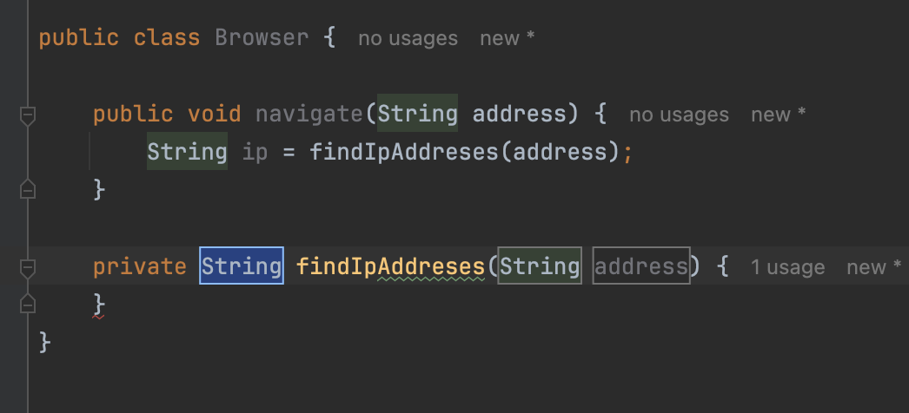<figcaption></figcaption></figure>

</div>

<div align="left">

<figure>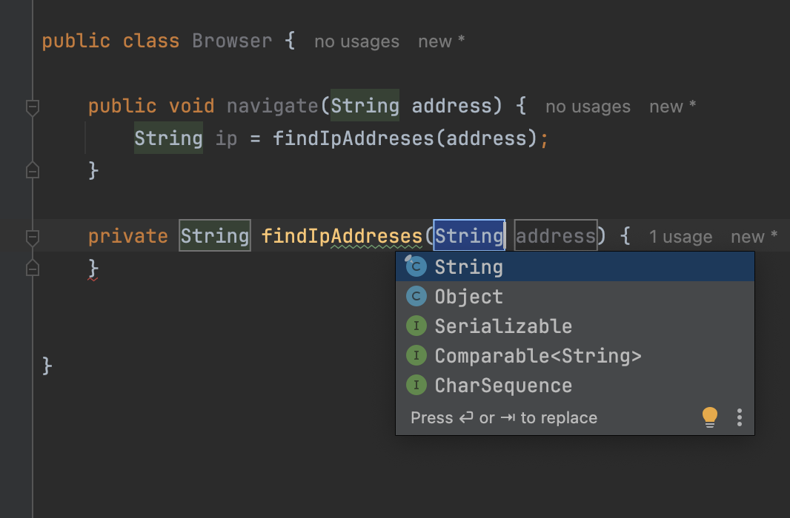<figcaption></figcaption></figure>

</div>

## 🇻 Create Variable

<div align="left">

<figure>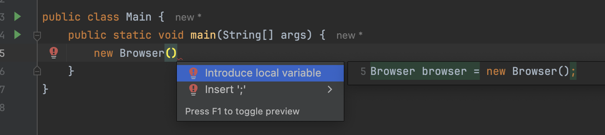<figcaption></figcaption></figure>

</div>

<div align="left">

<figure>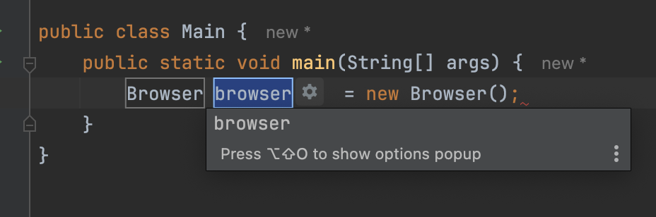<figcaption></figcaption></figure>

</div>

<div align="left">

<figure>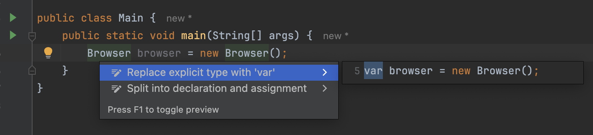<figcaption></figcaption></figure>

</div>

<div align="left">

<figure>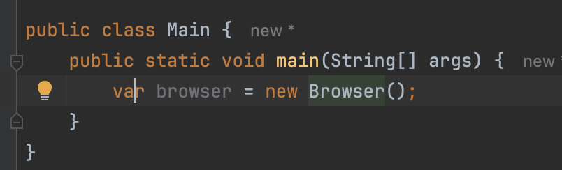<figcaption></figcaption></figure>

</div>


## 📊 View Usage


