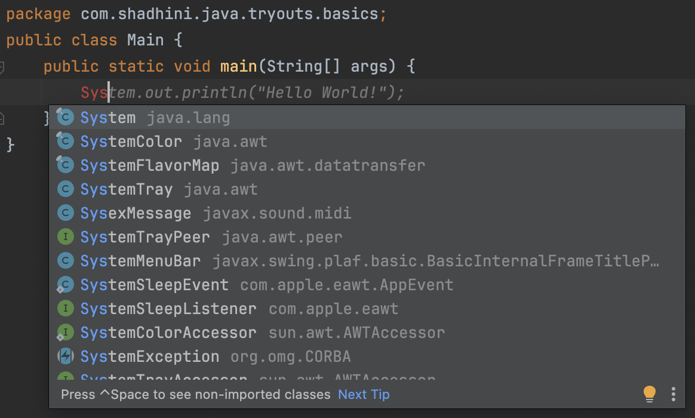
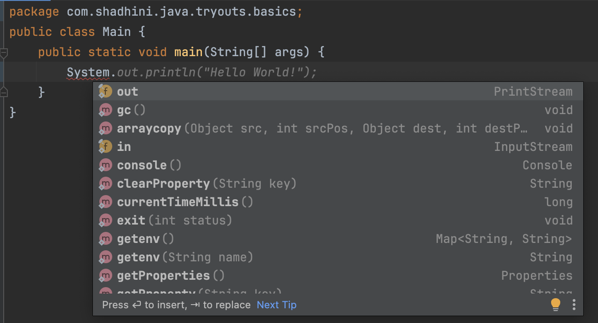

# View info with . and hovering cursor

### Cursor at the end/middle of the typed class name shows different declarations of the class in different packages.

* You can select which one to be imported using `↑` up and  `↓` down arrow keys. Pressing `return` after the selection will import that class to the current class.

<figure><figcaption></figcaption></figure>

### When type `.`  after typing a `class name`, you can view the `accessible members` defined in that class.

<figure><figcaption></figcaption></figure>

* \->  This shows the accessible members defined in the `System` class.
* \->  `out` is a field of `System` class of type `PrintStream`; `PrintStream` is another class defined in Java.

### When type `.`  after typing a `field name/object name`, you can view the `accessible members` defined in the class of fields'/objects' type.

<figure><figcaption></figcaption></figure>

* `System.out` field of `System` class is of type `PrintStream`.
* This shows the accessible members defined in the `PrintStream` class for an object of that class.
