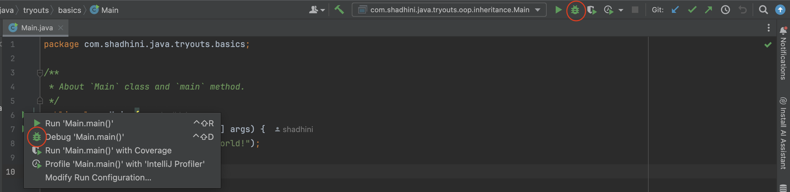

# Shortcuts

## 💬 Comments&#x20;

Line comment: cursor on line ->  `command` + `/`&#x20;

Line comments on multiple lines: select multiple lines ->  `command` + `/`&#x20;

Doc comment: type `/**` -> return

Multiple line comment: type `/*` -> return


## 💡View Hints; Bulb Options; Suggestions @ Cursor

`option` + `return`


## ▶️ Run & 🐞 Debug

Execute/Run a program:   `control ^` + `R`

<figure><figcaption><p>Note red circles for <code>Run</code> icon</p></figcaption></figure>

Debug a program: `control ^` + `D`

<figure><figcaption><p>Note red circles for <code>Debug</code> icon</p></figcaption></figure>

Debug Breakpoints Console: `command` + `fn` + `shift` + `F8`


## 📑 Duplicate Code

Select the code snippet to be duplicated.

`command` + `D`


## 🔀 Move Code Snippets

Move Up: `shift` + `option` + `↑`

Move Down: `shift` + `option` + `↓`


## 🔎 Navigation & Search&#x20;

Navigate to method declaration: `command` + `B`

See method parameter info: `command` + `P`&#x20;


## Quick Method Generation

To generate following code snippet of `main` method,&#x20;

```java
public static void main(String[] args) {
        
}
```

type `psvm` and press `return`

<div align="left">

<figure><figcaption></figcaption></figure>

</div>

***

To generate following code snippet to print a string,

```java
System.out.println();
```

type `sout` and press `return`

<div align="left">

<figure><figcaption></figcaption></figure>

</div>

***


## View Usage


