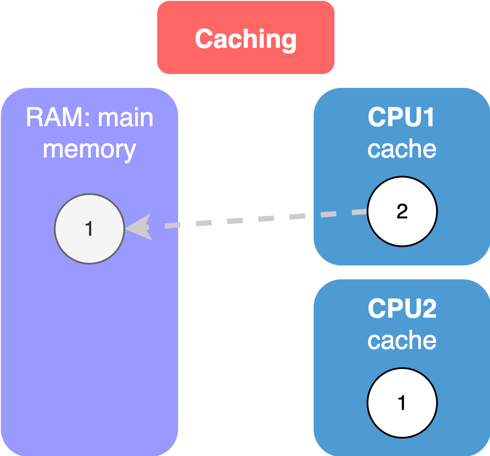

# Caching Values by Threads

## Caching Values by Threads

<figure><figcaption></figcaption></figure>

Say we have an integer field with value=1; then this value is stored in the **main memory** or **RAM**.&#x20;

Say, we have 2 threads running by 2 different CPU cores, and this field value is accessed by both threads.&#x20;

**Each CPU has a cache**, which is a small amount of memory available locally in that CPU.

Reading the data from this cache is faster as the data is closer to the CPU. So it doesn't have to travel far; it doesn't have to travel between the CPU and the main memory.

Now, what happens is,

2 threads read the value of the field and store it locally.&#x20;

Now, the 1st thread changes it's value. But this **change is only local to the thread**. So the 2nd thread doesn't see the change.

Even if 1st thread writes the change back into the main memory, the 2nd thread doesn't see the change  as it already has the value of this field in it's cache.

╰┈➤ **`Visibility Problem`**

Solution is use of `volatile` keyword for field declaration.
