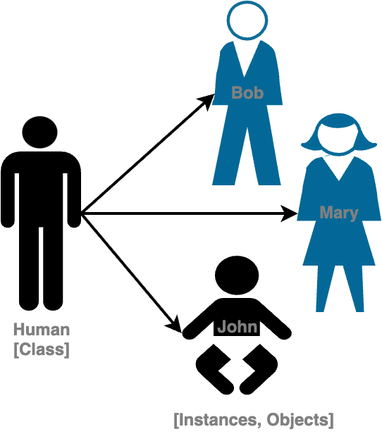

# Class & Object

> **`Class`** define **template** or **blueprint** for creating new objects; new instances.
>
> **`Object`** is an **instance** of a class.

<figure><figcaption></figcaption></figure>

These classes/objects have members we can access using dot operator.

