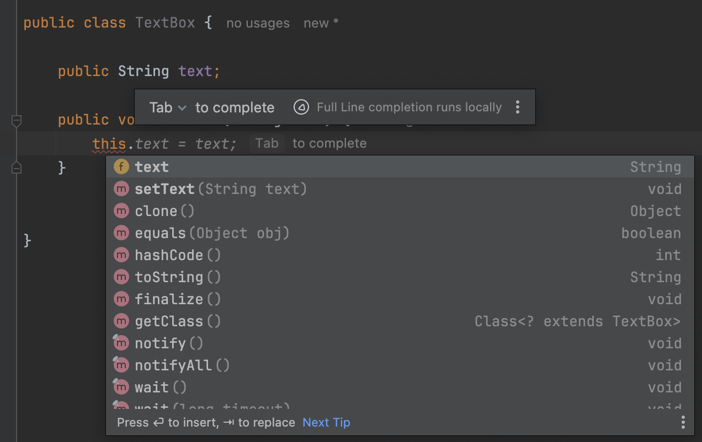

# Classes & Objects

> **`Class`** define **template** or **blueprint** for creating new objects; new instances.
>
> **`Object`** is an **instance** of a class.

<figure><figcaption></figcaption></figure>

<figure><figcaption></figcaption></figure>

**Methods change the state of an object.**

&#x20;   e.g:

* if `changeGear()` method is called, the value of the `currentGear` field changes.
* So, methods change the values of the fields.

Using this `Car` **template (i.e. class), we can create car objects;** `car1`, `car2`, `car3`.

* All these car objects will have the same fields and methods.
* But they are **independent of each other**.
* Each car object will be in separate space in memory, and it can be in a separate state; i.e. data in each car object can be different.

These classes/objects have members we can access using dot operator.

<figure><figcaption></figcaption></figure>

## `this` keyword

In a situation where a name of a (method) parameter is same as the name od (class) field, we can use the **`this`** keyword for clarity.

╰┈➤ a reference to the current object.

**`this.`** shows declared members of the current class also it shows some other members that comes through inheritance.&#x20;

* Because, every class we declare in Java, automatically inherits some members from **`Object`** class.

<figure><figcaption></figcaption></figure>

## Fields

❗In Java we should **not** declare fields as **public**.

## Declaring & Instantiating Classes





