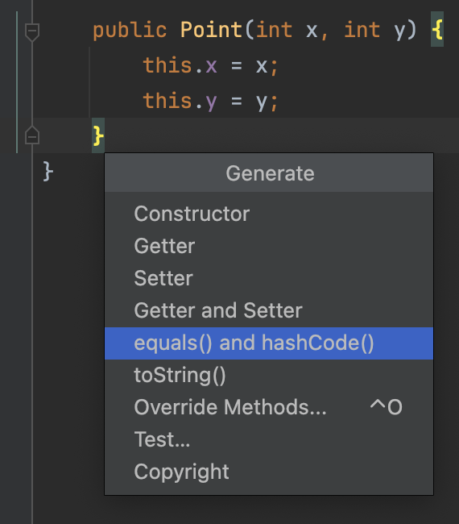

# Comparing Objects

## Comparing Objects

> The **default** implementation of **`equals()`** method in `Object` class compares 2 objects based on their **reference**.&#x20;
>
> **`hashCode()`** method of `Object` class returns a **numeric value** that is calculated based on the **address** of the object in memory.
>
> If you want to compare objects based on the content, then you have to **`override`** `equals()` method in the Class of interest.

## Best Practice

✅  Whenever we override `equals()` method of `Object` class we should also override the `hashCode()` method of `Object` class.

## Example







## More On ...

<table data-view="cards"><thead><tr><th></th><th data-hidden data-card-target data-type="content-ref"></th></tr></thead><tbody><tr><td><strong>Hash</strong></td><td><a href="hash.md">hash.md</a></td></tr></tbody></table>

## Generating equals() and hashCode() methods with IntelliJIDEA IDE

`command` + `N` -> `equals() and hashCode()`

<figure><figcaption></figcaption></figure>

