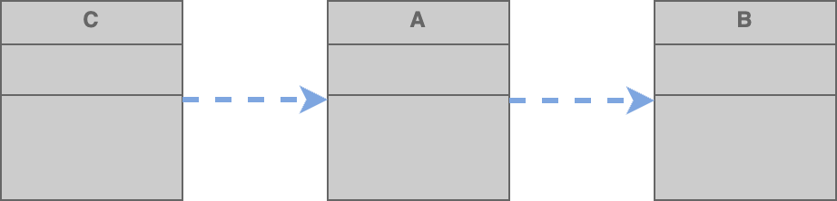
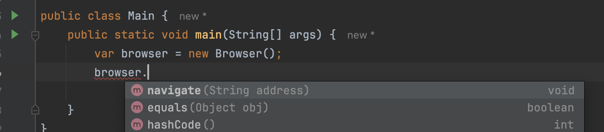

# Coupling

> **About the level of dependency between software entities (eg classes)**
>
> Reduce coupling -> Reduce impact of changes
>
> * The more classes coupled to each other, the more costly the changes are going to be.
>
> Less methods in class & Private methods -> Hide implementation -> Reduce Coupling

## Metaphor: Mobile phone and you

* The more you use your phone, the more you are dependent on it.&#x20;
* You are coupled to phone.
* If someone takes the phone from you, then you are gonna have a difficult time living.

## We need to reduce coupling between classes.

* There's no such thins as no/zero coupling.
* There is always coupling.
* Always classes we create should work together to perform some tasks.
* We just need to reduce coupling.

## Issue with Coupling

<figure><figcaption></figcaption></figure>

Here,

* Class A is using class B; so it's coupled to class B.
* If we change class B, class A may have to be modified or at least it has to be recompiled.
* Also any other class that are dependent on class A may have to be modified or at least recompiled.

This is a huge issue in large applications with 1000 of many classes.

* If you change a class you might end up with 100 broken classes&#x20;
* The more classes coupled to each other, the more costly the changes are going to be.

**`Reduce coupling -> Reduce impact of changes`**

## Reduce Coupling&#x20;

**`Less methods in class & Private methods -> Hide implementation -> Reduce Coupling`**

The more methods a class provides, the more other classes are going to get coupled.

* e.g: If your phone has 5 apps, you have 5 **coupling point** to your phone. If 100 apps, 100 coupling points.

**Functionality that needs not to be exposed to outside -> private methods**

* Then other classes using this won't be affected by modifications to the private methods.

## Example





<figure><figcaption></figcaption></figure>
