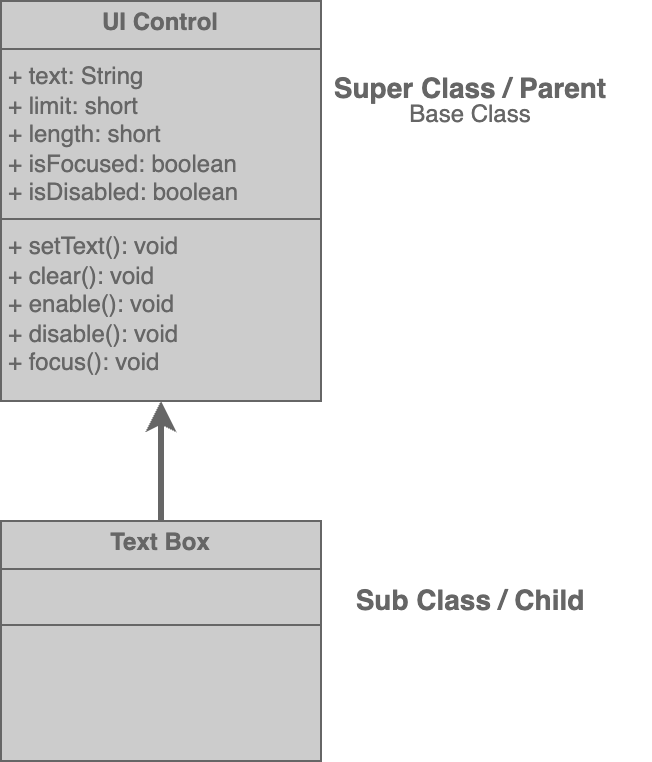

# Inheritance

## Inheritance

> a mechanism for reusing code
>
> **common behaviour -> Super class**
>
> sub classes inherit this common behavior by extending the super class.
>
> Represents an **`IS-A`** relationship.
>
> With inheritance we can achieve **`polymorphic`** behaviour.

When implementing, we don't want to implement **common behaviours** in every single class.&#x20;

╰┈➤ This is where we use **`Inheritance`** to **reuse code.**

&#x20;       Example Use-case:&#x20;

* Framework for building GUI (Graphical User Interface)
  * Can create forms with various types of input fields like text boxes, check boxes, drop down list.
  * All these objects share some common behaviour.
    *   e.g:&#x20;

        * we can enable, disable them
        * can set size in terms of width and height and so on.

We define **common behaviour** in a **`super class`** and have other classes inherit this behaviour from the super class.

<figure><figcaption></figcaption></figure>

#### IS-A Relationship:

* Here, every `text box` object **`is a`** `UI control` object.

### `super` Keyword

> **a reference to the base or parent class.**

We can use it to access the members (fields and methods) or call the constructors of the base class.&#x20;

### `this` keyword&#x20;

> **returns a reference to the current object.**

## Example&#x20;









### Upcasting & Downcasting







## More On ...


[object-class](object-class/)



[constructors.md](constructors.md)



[overriding-methods.md](overriding-methods.md)



[upcasting-and-downcasting.md](upcasting-and-downcasting.md)



[deep-inheritance.md](deep-inheritance.md)



[multiple-inheritance.md](multiple-inheritance.md)



[polymorphism.md](../polymorphism.md)


