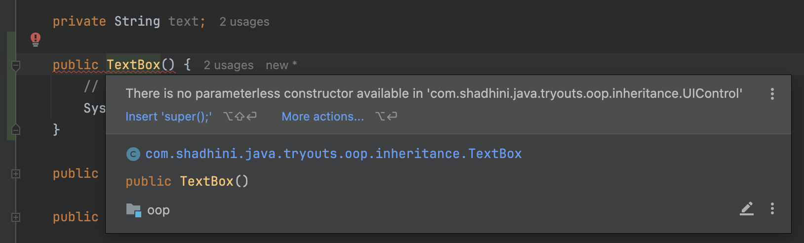
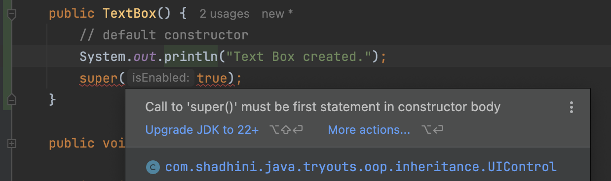

# Constructors

## Constructors & Inheritance

✅

```java
public class UIControl {

    private boolean isEnabled = true;

    public UIControl() {
        // default constructor
        System.out.println("UI Control created.");
    }
}

public class TextBox extends UIControl {

    private String text;

    public TextBox() {
        // default constructor
        System.out.println("Text Box created.");
    }
}

public class Main {

    public static void main(String[] args) {
        var control = new TextBox();
        /* Output:
        UI Control created.
        Text Box created.
         */
    }
}
```

***

❌

<pre class="language-java"><code class="lang-java">public class UIControl {

    private boolean isEnabled = true;

    public UIControl(boolean isEnabled) {
        this.isEnabled = isEnabled;
        System.out.println("UI Control created.");
    }
}

public class TextBox extends UIControl {

    private String text;

    <a data-footnote-ref href="#user-content-fn-1">public TextBox() {</a> // Compilation Error
        // default constructor
        System.out.println("Text Box created.");
    }
}
</code></pre>

<figure><figcaption></figcaption></figure>

***

❌

<pre class="language-java"><code class="lang-java">public class UIControl {

    private boolean isEnabled = true;

    public UIControl(boolean isEnabled) {
        this.isEnabled = isEnabled;
        System.out.println("UI Control created.");
    }
}

public class TextBox extends UIControl {

    private String text;

    public TextBox() { 
        // default constructor
        System.out.println("Text Box created.");
        <a data-footnote-ref href="#user-content-fn-2">super(true);</a> // Compilation Error in Java 11
    }
}
</code></pre>

<figure><figcaption></figcaption></figure>

***

✅

<pre class="language-java"><code class="lang-java">public class UIControl {

    private boolean isEnabled = true;

    public UIControl(boolean isEnabled) {
        this.isEnabled = isEnabled;
        System.out.println("UI Control created.");
    }
}

public class TextBox extends UIControl {

    private String text;

    public TextBox() { 
        // default constructor
<strong>        super(true);
</strong>        System.out.println("Text Box created.");
    }
}
</code></pre>


[^1]: Compilation Error

[^2]: Compilation Error in Java 11
